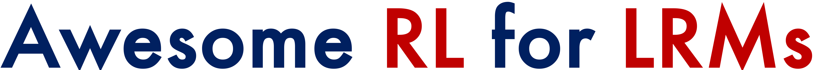
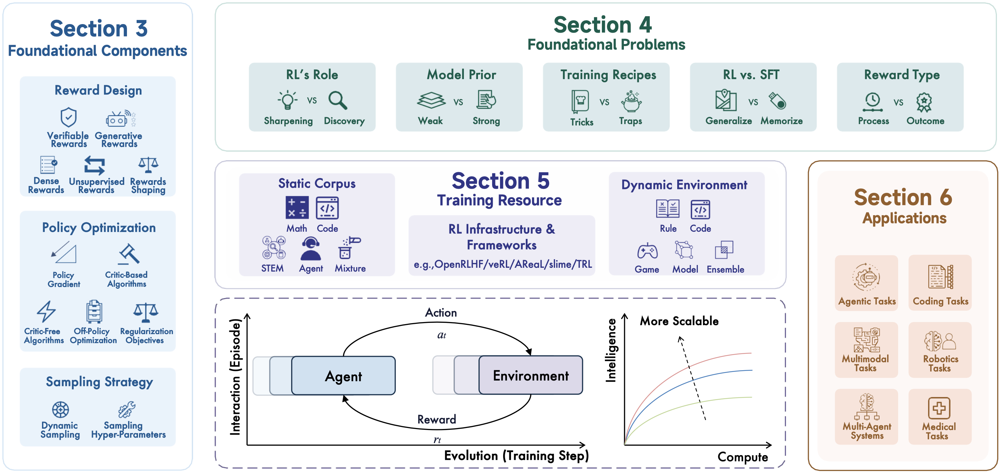

<div align="center">



## A Survey of Reinforcement Learning for Large Reasoning Models

[](https://github.com/sindresorhus/awesome) [](https://arxiv.org/abs/2509.08827)  [](https://github.com/TsinghuaC3I/Awesome-RL-Reasoning-Recipes)  [](https://huggingface.co/papers/2509.08827)  [](https://x.com/OkhayIea/status/1965989894163235111)

</div>

> We welcome everyone to open an issue for any related work we haven’t discussed, and we’ll try to address it in the next release!


## 🎉 News

- **[2025-11-05]** 🔥 Excited to release our paper list about **Memory for Agents**, covering breakthroughs in Context Management and Learning from Experience powering self-improving AI agents. Check it out: [GitHub](https://github.com/TsinghuaC3I/Awesome-Memory-for-Agents)
- **[2025-10]** 🎉 Honored to give talks at [BAAI](https://event.baai.ac.cn/activities/961), [Qingke Talk](https://qingkeai.online/archives/0h3Cm8Bi) and Tencent Wiztalk! Here are the [slides](Survey@RL4LRM-v1.pdf).
- **[2025-09-18]** 🎉 We update the full list of papers in the category structure of the survey!
- **[2025-09-12]** 🎉 Our survey was ranked **#1 Paper of the Day** on 🤗 [Hugging Face Daily Papers](https://huggingface.co/papers/2509.08827)!
- **[2025-09-11]** 🔥 Excited to release our **RL for LRMs Survey**! We’ll be updating the full list of papers in with a new category structure soon. Check it out: [Paper](https://huggingface.co/papers/2509.08827).
- **[2025-08-15]** 🔥 Introducing **SSRL**: an investigation for Agentic Search RL without reliance on external search engine. Check it out: [GitHub](https://github.com/TsinghuaC3I/SSRL) and [Paper](https://arxiv.org/abs/2508.10874).
- **[2025-05-27]** 🔥 Introducing **MARTI**: A Framework for LLM-based Multi-Agent Reinforced Training and Inference. Check it out: [Github](https://github.com/TsinghuaC3I/MARTI).
- **[2025-04-23]** 🔥 Introducing **TTRL**: an open-source solution for online RL on data without ground-truth labels, especially test data. Check it out: [Github](https://github.com/PRIME-RL/TTRL) and [Paper](https://arxiv.org/abs/2504.16084).
- **[2025-03-20]** 🔥 We are excited to introduce collection of papers and projects on RL for reasoning models!


## 🎈 Citation

If you find this survey helpful, please cite our work:

```bibtex
@article{zhang2025survey,
  title={A survey of reinforcement learning for large reasoning models},
  author={Zhang, Kaiyan and Zuo, Yuxin and He, Bingxiang and Sun, Youbang and Liu, Runze and Jiang, Che and Fan, Yuchen and Tian, Kai and Jia, Guoli and Li, Pengfei and others},
  journal={arXiv preprint arXiv:2509.08827},
  year={2025}
}
```

## 📖 Contents
- [A Survey of Reinforcement Learning for Large Reasoning Models](#a-survey-of-reinforcement-learning-for-large-reasoning-models)
- [🎉 News](#-news)
- [🎈 Citation](#-citation)
- [📖 Contents](#-contents)
- [🗺️ Overview](#️-overview)
- [📄 Paper List](#-paper-list)
  - [Frontier Models](#frontier-models)
  - [Reward Design](#reward-design)
    - [Generative Rewards](#generative-rewards)
    - [Dense Rewards](#dense-rewards)
    - [Unsupervised Rewards](#unsupervised-rewards)
    - [Rewards Shaping](#rewards-shaping)
  - [Policy Optimization](#policy-optimization)
    - [Policy Gradient Objective](#policy-gradient-objective)
    - [Critic-based Algorithms](#critic-based-algorithms)
    - [Critic-Free Algorithms](#critic-free-algorithms)
    - [Off-policy Optimization](#off-policy-optimization)
    - [Off-policy Optimization (Exp replay)](#off-policy-optimization-exp-replay)
    - [Regularization Objectives](#regularization-objectives)
  - [Sampling Strategy](#sampling-strategy)
    - [Dynamic and Structured Sampling](#dynamic-and-structured-sampling)
    - [Sampling Hyper-Parameters](#sampling-hyper-parameters)
  - [Training Resource](#training-resource)
    - [Static Corpus (Code)](#static-corpus-code)
    - [Static Corpus (STEM)](#static-corpus-stem)
    - [Static Corpus (Math)](#static-corpus-math)
    - [Static Corpus (Agent)](#static-corpus-agent)
    - [Static Corpus (Mix)](#static-corpus-mix)
    - [Dynamic Environment (Rule-based)](#dynamic-environment-rule-based)
    - [Dynamic Environment (Code-based)](#dynamic-environment-code-based)
    - [Dynamic Environment (Game-based)](#dynamic-environment-game-based)
    - [Dynamic Environment (Model-based)](#dynamic-environment-model-based)
    - [Dynamic Environment (Ensemble-based)](#dynamic-environment-ensemble-based)
    - [RL Infrastructure (Primary)](#rl-infrastructure-primary)
    - [RL Infrastructure (Secondary)](#rl-infrastructure-secondary)
  - [Applications](#applications)
    - [Coding Agent](#coding-agent)
    - [Search Agent](#search-agent)
    - [Browser-Use Agent](#browser-use-agent)
    - [DeepResearch Agent](#deepresearch-agent)
    - [GUI\&Computer Agent](#guicomputer-agent)
    - [Recommendation Agent](#recommendation-agent)
    - [Agent (Others)](#agent-others)
    - [Code Generation](#code-generation)
    - [Software Engineering](#software-engineering)
    - [Multimodal Understanding](#multimodal-understanding)
    - [Multimodal Generation](#multimodal-generation)
    - [Robotics Tasks](#robotics-tasks)
    - [Multi-Agent Systems](#multi-agent-systems)
    - [Scientific Tasks](#scientific-tasks)
- [🌟 Acknowledgment](#-acknowledgment)
- [✨ Star History](#-star-history)


## 🗺️ Overview

Our survey provides a comprehensive examination of **Reinforcement Learning for Large Reasoning Models**.

<p align="center">
   
</p>

We organize the survey into five main sections:

1. <u>Foundational Components:</u> Reward design, policy optimization, and sampling strategies
2. <u>Foundational Problems:</u> Key debates and challenges in RL for LRMs
3. <u>Training Resources:</u> Static corpora, dynamic environments, and infrastructure
4. <u>Applications:</u> Real-world implementations across diverse domains
5. <u>Future Directions:</u> Emerging research opportunities and challenges

## 📄 Paper List

### Frontier Models

| Date | Name | Title | Paper | Github |
|:-:|:-:|:-|:-:|:-:|
| 2025-08 | `Intern-S1` | Intern-S1: A Scientific Multimodal Foundation Model | [](https://arxiv.org/abs/2508.15763v1) | [](https://github.com/InternLM/Intern-S1) |
| 2025-08 | `GLM-4.5` | GLM-4.5: Agentic, Reasoning, and Coding (ARC) Foundation Models | [](https://arxiv.org/abs/2508.06471) | [](https://github.com/zai-org/GLM-4.5) |
| 2025-08 | `gpt-oss` | gpt-oss-120b & gpt-oss-20b Model Card | [](https://arxiv.org/abs/2508.10925) | [](https://github.com/openai/gpt-oss) |
| 2025-08 | `InternVL3.5` | InternVL3.5: Advancing Open-Source Multimodal Models in Versatility, Reasoning, and Efficiency | [](https://arxiv.org/abs/2508.18265) | [](https://github.com/OpenGVLab/InternVL) |
| 2025-07 | `Kimi K2` | Kimi K2: Open Agentic Intelligence | [](https://arxiv.org/abs/2507.20534) | [](https://github.com/MoonshotAI/Kimi-K2) |
| 2025-07 | `Step 3` | Step-3 is Large yet Affordable: Model-system Co-design for Cost-effective Decoding | [](https://arxiv.org/abs/2507.19427) | [](https://github.com/stepfun-ai/Step3) |
| 2025-07 | `GLM-4.1V-Thinking` | GLM-4.5V and GLM-4.1V-Thinking: Towards Versatile Multimodal Reasoning with Scalable Reinforcement Learning | [](https://arxiv.org/abs/2507.01006) | [](https://github.com/zai-org/GLM-V) |
| 2025-07 | `Skywork-R1V3` | Skywork-R1V3 Technical Report | [](https://arxiv.org/abs/2507.06167) | [](https://github.com/SkyworkAI/Skywork-R1V) |
| 2025-07 | `GLM-4.5V` | GLM-4.5V and GLM-4.1V-Thinking: Towards Versatile Multimodal Reasoning with Scalable Reinforcement Learning | [](https://arxiv.org/abs/2507.01006) | [](https://github.com/zai-org/GLM-V) |
| 2025-06 | `Magistral` | Magistral | [](https://arxiv.org/abs/2506.10910) | - |
| 2025-06 | `Minimax-M1` | MiniMax-M1: Scaling Test-Time Compute Efficiently with Lightning Attention | [](https://arxiv.org/abs/2506.13585) | [](https://github.com/MiniMax-AI/MiniMax-M1) |
| 2025-05 | `MiMo` | MiMo: Unlocking the Reasoning Potential of Language Model -- From Pretraining to Posttraining | [](https://arxiv.org/abs/2505.07608) | [](https://github.com/XiaomiMiMo/MiMo) |
| 2025-05 | `Qwen3` | Qwen3 Technical Report | [](https://arxiv.org/abs/2505.09388) | [](https://github.com/QwenLM/Qwen3) |
| 2025-05 | `Llama-Nemotron-Ultra` | Llama-Nemotron: Efficient Reasoning Models | [](https://arxiv.org/abs/2505.00949) | [](https://github.com/NVIDIA/Megatron-LM) |
| 2025-05 | `INTELLECT-2` | INTELLECT-2: A Reasoning Model Trained Through Globally Decentralized Reinforcement Learning | [](https://arxiv.org/abs/2505.07291) | - |
| 2025-05 | `Hunyuan-TurboS` | Hunyuan-TurboS: Advancing Large Language Models through Mamba-Transformer Synergy and Adaptive Chain-of-Thought | [](https://arxiv.org/abs/2505.15431) | [](https://github.com/Tencent/Hunyuan-TurboS) |
| 2025-05 | `Skywork OR-1` | Skywork Open Reasoner 1 Technical Report | [](https://arxiv.org/abs/2505.22312) | [](https://github.com/SkyworkAI/Skywork-OR1) |
| 2025-04 | `Phi-4 Reasoning` | Phi-4-reasoning Technical Report | [](https://arxiv.org/abs/2504.21318) | - |
| 2025-04 | `Skywork-R1V2` | Skywork R1V2: Multimodal Hybrid Reinforcement Learning for Reasoning | [](https://arxiv.org/abs/2504.16656) | [](https://github.com/SkyworkAI/Skywork-R1V) |
| 2025-04 | `InternVL3` | InternVL3: Exploring Advanced Training and Test-Time Recipes for Open-Source Multimodal Models | [](https://arxiv.org/abs/2504.10479) | [](https://github.com/OpenGVLab/InternVL) |
| 2025-03 | `ORZ` | Open-Reasoner-Zero: An Open Source Approach to Scaling Up Reinforcement Learning on the Base Model | [](https://arxiv.org/abs/2503.24290) | [](https://github.com/Open-Reasoner-Zero/Open-Reasoner-Zero) |
| 2025-01 | `DeepSeek-R1` | DeepSeek-R1: Incentivizing Reasoning Capability in LLMs via Reinforcement Learning | [](https://arxiv.org/abs/2501.12948) | [](https://github.com/deepseek-ai/DeepSeek-R1) |
| - | `QwQ` | QwQ-32B: Embracing the Power of Reinforcement Learning | [](https://qwenlm.github.io/blog/qwq-32b/) | [](https://github.com/QwenLM/QwQ) |
| - | `Seed-OSS` | Seed-OSS Open-Source Models | [](https://github.com/ByteDance-Seed/seed-oss) | [](https://github.com/ByteDance-Seed/seed-oss) |
| - | `ERNIE-4.5-Thinking` | ERNIE 4.5 Technical Report | [](https://ernie.baidu.com/blog/publication/ERNIE_Technical_Report.pdf) | - |


### Reward Design
#### Generative Rewards

| Date | Name | Title | Paper | Github |
|:-:|:-:|:-|:-:|:-:|
| 2025-08 | `CAPO` | CAPO: Towards Enhancing LLM Reasoning through Verifiable Generative Credit Assignment | [](https://arxiv.org/abs/2508.02298) | [](https://github.com/andyclsr/CAPO) |
| 2025-08 | `CompassVerifier` | CompassVerifier: A Unified and Robust Verifier for LLMs Evaluation and Outcome Reward | [](https://arxiv.org/abs/2508.03686) | [](https://github.com/open-compass/CompassVerifier) |
| 2025-08 | `Cooper` | Cooper: Co-Optimizing Policy and Reward Models in Reinforcement Learning for Large Language Models | [](https://arxiv.org/abs/2508.05613) | [](https://github.com/zju-real/cooper) |
| 2025-08 | `ReviewRL` | ReviewRL: Towards Automated Scientific Review with RL | [](https://arxiv.org/abs/2508.10308) | [](https://github.com/TsinghuaC3I/MARTI) |
| 2025-08 | `Rubicon` | Reinforcement Learning with Rubric Anchors | [](https://arxiv.org/abs/2508.12790) | - |
| 2025-08 | `RuscaRL` | Breaking the Exploration Bottleneck: Rubric-Scaffolded Reinforcement Learning for General LLM Reasoning | [](https://arxiv.org/abs/2508.16949) | - |
| 2025-07 | `OMNI-THINKER` | OMNI-THINKER: Scaling Cross-Domain Generalization in LLMs via Multi-Task RL with Hybrid Rewards | [](https://arxiv.org/abs/2507.14783) | - |
| 2025-07 | `URPO` | URPO: A Unified Reward & Policy Optimization Framework for Large Language Models | [](https://arxiv.org/abs/2507.17515) | - |
| 2025-07 | `RaR` | Rubrics as Rewards: Reinforcement Learning Beyond Verifiable Domains | [](https://arxiv.org/abs/2507.17746) | - |
| 2025-07 | `RLCF` | Checklists Are Better Than Reward Models For Aligning Language Models | [](https://arxiv.org/abs/2507.18624) | - |
| 2025-07 | `PCL` | Post-Completion Learning for Language Models | [](https://arxiv.org/abs/2507.20252) | - |
| 2025-07 | `K2` | KIMI K2: OPEN AGENTIC INTELLIGENCE | [](https://arxiv.org/abs/2507.20534) | - |
| 2025-07 | `LIBRA` | LIBRA: ASSESSING AND IMPROVING REWARD MODEL BY LEARNING TO THINK | [](https://arxiv.org/abs/2507.21645) | - |
| 2025-07 | `TP-GRPO` | Good Learners Think Their Thinking: Generative PRM Makes Large Reasoning Model More Efficient Math Learner | [](https://arxiv.org/abs/2507.23317) | [](https://github.com/cs-holder/tp_grpo) |
| 2025-06 | `RewardAnything` | RewardAnything: Generalizable Principle-Following Reward Models | [](https://arxiv.org/abs/2506.03637) | [](https://zhuohaoyu.github.io/RewardAnything/) |
| 2025-06 | `Writing-Zero` | Writing-Zero: Bridge the Gap Between Non-verifiable Tasks and Verifiable Rewards | [](https://arxiv.org/abs/2506.00103) | - |
| 2025-06 | `Critique-GRPO` | Critique-GRPO: Advancing LLM Reasoning with Natural Language and Numerical Feedback | [](https://arxiv.org/abs/2506.03106) | [](https://github.com/zhangxy-2019/critique-GRPO) |
| 2025-06 | `PAG` | PAG: Multi-Turn Reinforced LLM Self-Correction with Policy as Generative Verifier | [](https://arxiv.org/abs/2506.10406) | - |
| 2025-06 | `GRAM` | GRAM: A Generative Foundation Reward Model for Reward Generalization | [](https://arxiv.org/abs/2506.14175) | [](https://github.com/NiuTrans/GRAM) |
| 2025-06 | `ProxyReward` | From General to Targeted Rewards: Surpassing GPT-4 in Open-Ended Long-Context Generation | [](https://arxiv.org/abs/2506.16024) | - |
| 2025-06 | `QA-LIGN` | QA-LIGN: Aligning LLMs through Constitutionally Decomposed QA | [](https://arxiv.org/abs/2506.08123) | - |
| 2025-05 | `RM-R1` | RM-R1: Reward Modeling as Reasoning | [](https://arxiv.org/abs/2505.02387) | [](https://github.com/RM-R1-UIUC/RM-R1) |
| 2025-05 | `J1` | J1: Incentivizing Thinking in LLM-as-a-Judge via RL | [](https://arxiv.org/abs/2505.10320) | - |
| 2025-05 | `TinyV` | TinyV: Reducing False Negatives in Verification Improves RL for LLM Reasoning | [](https://arxiv.org/abs/2505.14625) | [](https://github.com/uw-nsl/TinyV) |
| 2025-05 | `General-Reasoner` | General-reasoner: Advancing llm reasoning across all domains | [](https://arxiv.org/abs/2505.14652) | - |
| 2025-05 | `RRM` | Reward Reasoning Model | [](https://arxiv.org/abs/2505.14674) | - |
| 2025-05 | `RL Tango` | RL Tango: Reinforcing Generator and Verifier Together for Language Reasoning | [](https://arxiv.org/abs/2505.15034) | [](https://github.com/kaiwenzha/rl-tango) |
| 2025-05 | `Think-RM` | Think-RM: Enabling Long-Horizon Reasoning in Generative Reward Models | [](https://arxiv.org/abs/2505.16265) | [](https://github.com/IlgeeHong/Think-RM) |
| 2025-04 | `JudgeLRM` | JudgeLRM: Large Reasoning Models as a Judge | [](https://arxiv.org/abs/2504.00050) | [](https://github.com/NuoJohnChen/JudgeLRM) |
| 2025-04 | `GenPRM` | GenPRM: Scaling Test-Time Compute of Process Reward Models via Generative Reasoning | [](https://arxiv.org/abs/2504.00891) | [](https://github.com/RyanLiu112/GenPRM) |
| 2025-04 | `DeepSeek-GRM` | Inference-Time Scaling for Generalist Reward Modeling | [](https://arxiv.org/abs/2504.02495) | - |
| 2025-04 | `AIR` | AIR: A Systematic Analysis of Annotations, Instructions, and Response Pairs in Preference Dataset | [](https://arxiv.org/abs/2504.03612) | - |
| 2025-04 | `Pairwise-RL` | A Unified Pairwise Framework for RLHF: Bridging Generative Reward Modeling and Policy Optimization | [](https://arxiv.org/abs/2504.04950) | - |
| 2025-04 | `xVerify` | xVerify: Efficient Answer Verifier for Reasoning Model Evaluations | [](https://arxiv.org/abs/2504.10481) | [](https://github.com/IAAR-Shanghai/xVerify) |
| 2025-04 | `Seed-Thinking-v1.5` | Seed1.5-Thinking: Advancing Superb Reasoning Models with Reinforcement Learning | [](https://arxiv.org/abs/2504.13914) | - |
| 2025-04 | `ThinkPRM` | Process Reward Models That Think | [](https://arxiv.org/abs/2504.16828) | [](https://github.com/mukhal/thinkprm) |
| 2025-03 | - | Crossing the Reward Bridge: Expanding RL with Verifiable Rewards Across Diverse Domains | [](https://arxiv.org/abs/2503.23829) | - |
| 2025-02 | - | Self-rewarding correction for mathematical reasoning | [](https://arxiv.org/abs/2502.19613) | [](https://github.com/RLHFlow/Self-rewarding-reasoning-LLM) |
| 2024-10 | `GenRM` | Generative Reward Models | [](https://arxiv.org/abs/2410.12832) | - |
| 2024-08 | `CLoud` | Critique-out-Loud Reward Models | [](https://arxiv.org/abs/2408.11791) | [](https://github.com/zankner/CLoud) |
| 2024-08 | `Generative Verifier` | Generative Verifiers: Reward Modeling as Next-Token Prediction | [](https://arxiv.org/abs/2408.15240) | - |
| 2024-01 | `Self-Rewarding LM` | Self-Rewarding Language Models | [](https://arxiv.org/abs/2401.10020) | - |
| 2023-10 | `Auto-J` | Generative Judge for Evaluating Alignment | [](https://arxiv.org/abs/2310.05470) | [](https://github.com/GAIR-NLP/auto-j) |
| 2023-06 | `Judge LLM-as-a-Judge` | Judging llm-as-a-judge with mt-bench and chatbot arena | [](https://arxiv.org/abs/2306.05685) | [](https://github.com/lm-sys/FastChat) |

#### Dense Rewards

| Date | Name | Title | Paper | Github |
|:-:|:-:|:-|:-:|:-:|
| 2025-09 | `Tree-GRPO` | Tree Search for LLM Agent Reinforcement Learning | [](https://arxiv.org/abs/2509.21240) | [](https://github.com/AMAP-ML/Tree-GRPO) |
| 2025-09 | `AttnRL` | Attention as a Compass: Efficient Exploration for Process-Supervised RL in Reasoning Models | [](https://arxiv.org/pdf/2509.26628) | [](https://github.com/RyanLiu112/AttnRL) |
| 2025-09 | `TARL` | Process-Supervised Reinforcement Learning for Interactive Multimodal Tool-Use Agents | [](https://arxiv.org/pdf/2509.14480) | - |
| 2025-09 | `PROF` | Beyond Correctness: Harmonizing Process and Outcome Rewards through RL Training | [](https://arxiv.org/abs/2509.03403) | [](https://github.com/Chenluye99/PROF) |
| 2025-09 | `HICRA` | Emergent Hierarchical Reasoning in LLMs through Reinforcement Learning | [](https://arxiv.org/abs/2509.03646) | - |
| 2025-08 | `KlearReasoner` | Klear-Reasoner: Advancing Reasoning Capability via Gradient-Preserving Clipping Policy Optimization | [](https://arxiv.org/abs/2508.07629) | [](https://github.com/Kwai-Klear/KlearReasoner) |
| 2025-08 | `CAPO` | CAPO: Towards Enhancing LLM Reasoning through Verifiable Generative Credit Assignment | [](https://arxiv.org/abs/2508.02298) | [](https://github.com/andyclsr/CAPO) |
| 2025-08 | `GTPO & GRPO-S` | GTPO and GRPO-S: Token and Sequence-Level Reward Shaping with Policy Entropy | [](https://arxiv.org/abs/2508.04349) | - |
| 2025-08 | `VSRM` | Promoting Efficient Reasoning with Verifiable Stepwise Reward | [](https://arxiv.org/abs/2508.10293) | - |
| 2025-08 | `G-RA` | Stabilizing Long-term Multi-turn Reinforcement Learning with Gated Rewards | [](https://arxiv.org/abs/2508.10548) | - |
| 2025-08 | `SSPO` | SSPO: Self-traced Step-wise Preference Optimization for Process Supervision and Reasoning Compression | [](https://arxiv.org/abs/2508.12604) | - |
| 2025-08 | `AIRL-S` | Your Reward Function for RL is Your Best PRM for Search: Unifying RL and Search-Based TTS | [](https://arxiv.org/abs/2508.14313) | - |
| 2025-08 | `TreePO` | TreePO: Bridging the Gap of Policy Optimization and Efficacy and Inference Efficiency with Heuristic Tree-based Modeling | [](https://arxiv.org/abs/2508.17445) | [](https://github.com/multimodal-art-projection/TreePO) |
| 2025-08 | `MUA-RL` | MUA-RL: Multi-turn User-interacting Agent Reinforcement Learning for agentic tool use | [](https://arxiv.org/abs/2508.18669) | - |
| 2025-07 | `SPRO` | Self-Guided Process Reward Optimization with Redefined Step-wise Advantage for Process Reinforcement | [](https://arxiv.org/abs/2507.01551) | - |
| 2025-07 | `FR3E` | First Return, Entropy-Eliciting Explore | [](https://arxiv.org/abs/2507.07017) | - |
| 2025-07 | `ARPO` | Agentic Reinforced Policy Optimization | [](https://arxiv.org/abs/2507.19849) | [](https://github.com/RUC-NLPIR/ARPO) |
| 2025-07 | `TP-GRPO` | Good Learners Think Their Thinking: Generative PRM Makes Large Reasoning Model More Efficient Math Learner | [](https://arxiv.org/abs/2507.23317) | [](https://github.com/cs-holder/tp_grpo) |
| 2025-06 | `TreeRPO` | TreeRPO: Tree Relative Policy Optimization | [](https://arxiv.org/abs/2506.05183) | [](https://github.com/yangzhch6/TreeRPO) |
| 2025-06 | `TreeRL` | TreeRL: LLM Reinforcement Learning with On-Policy Tree Search | [](https://arxiv.org/abs/2506.11902) | [](https://github.com/THUDM/TreeRL) |
| 2025-06 | `Entropy Advantage` | Reasoning with Exploration: An Entropy Perspective on Reinforcement Learning for LLMs | [](https://arxiv.org/abs/2506.14758) | - |
| 2025-06 | `ReasonFlux-PRM` | ReasonFlux-PRM: Trajectory-Aware PRMs for Long Chain-of-Thought Reasoning in LLMs | [](https://arxiv.org/abs/2506.18896) | [](https://github.com/Gen-Verse/ReasonFlux) |
| 2025-05 | `S-GRPO` | S-GRPO: Early Exit via Reinforcement Learning in Reasoning Models | [](https://arxiv.org/abs/2505.07686) | - |
| 2025-05 | `GiGPO` | Group-in-Group Policy Optimization for LLM Agent Training | [](https://arxiv.org/abs/2505.10978) | [](https://github.com/langfengQ/verl-agent) |
| 2025-05 | - | Reinforcing Multi-Turn Reasoning in LLM Agents via Turn-Level Credit Assignment | [](https://arxiv.org/abs/2505.11821) | - |
| 2025-05 | `Tango` | RL Tango: Reinforcing Generator and Verifier Together for Language Reasoning | [](https://arxiv.org/abs/2505.15034) | [](https://github.com/kaiwenzha/rl-tango) |
| 2025-05 | `StepSearch` | StepSearch: Igniting LLMs Search Ability via Step-Wise Proximal Policy Optimization | [](https://arxiv.org/abs/2505.15107) | [](https://github.com/Zillwang/StepSearch) |
| 2025-05 | - | Aligning Dialogue Agents with Global Feedback via Large Language Model Reward Decomposition | [](https://arxiv.org/abs/2505.15922) | - |
| 2025-05 | `Tool-Star` | Tool-Star: Empowering LLM-Brained Multi-Tool Reasoner via Reinforcement Learning | [](https://arxiv.org/abs/2505.16410) | [](https://github.com/dongguanting/Tool-Star) |
| 2025-05 | `SPA-RL` | SPA-RL: Reinforcing LLM Agents via Stepwise Progress Attribution | [](https://arxiv.org/abs/2505.20732) | [](https://github.com/WangHanLinHenry/SPA-RL-Agent) |
| 2025-05 | `SPO` | Segment Policy Optimization: Effective Segment-Level Credit Assignment in RL for Large Language Mode | [](https://arxiv.org/abs/2505.23564) | [](https://github.com/AIFrameResearch/SPO) |
| 2025-04 | `GenPRM` | GenPRM: Scaling Test-Time Compute of Process Reward Models via Generative Reasoning | [](https://arxiv.org/abs/2504.00891) | [](https://github.com/RyanLiu112/GenPRM) |
| 2025-04 | `PURE` | Stop Summation: Min-Form Credit Assignment Is All Process Reward Model Needs for Reasoning | [](https://arxiv.org/abs/2504.15275) | [](https://github.com/CJReinforce/PURE) |
| 2025-03 | `MRT` | Optimizing Test-Time Compute via Meta Reinforcement Fine-Tuning | [](https://arxiv.org/abs/2503.07572) | [](https://github.com/CMU-AIRe/MRT) |
| 2025-03 | `SWEET-RL` | SWEET-RL: Training Multi-Turn LLM Agents on Collaborative Reasoning Tasks | [](https://arxiv.org/abs/2503.15478) | [](https://github.com/facebookresearch/sweet_rl) |
| 2025-02 | `PRIME` | Process Reinforcement through Implicit Rewards | [](https://arxiv.org/abs/2502.01456) | [](https://github.com/PRIME-RL/PRIME) |
| 2024-12 | `Implicit PRM` | Free Process Rewards without Process Labels | [](https://arxiv.org/abs/2412.01981) | [](https://github.com/PRIME-RL/ImplicitPRM) |
| 2024-10 | `VinePPO` | VinePPO: Refining Credit Assignment in RL Training of LLMs | [](https://arxiv.org/abs/2410.01679) | [](https://github.com/McGill-NLP/VinePPO) |
| 2024-10 | `PAV` | Rewarding Progress: Scaling Automated Process Verifiers for LLM Reasoning | [](https://arxiv.org/abs/2410.08146) | - |
| 2024-04 | - | From $r$ to $Q^*$: Your Language Model is Secretly a Q-Function | [](https://arxiv.org/abs/2404.12358) | - |
| 2024-03 | `GELI` | Improving Dialogue Agents by Decomposing One Global Explicit Annotation with Local Implicit Multimodal Feedback | [](https://arxiv.org/abs/2403.11330) | - |
| 2023-12 | `Math-Shepherd` | Math-Shepherd: Verify and Reinforce LLMs Step-by-step without Human Annotations | [](https://arxiv.org/abs/2312.08935) | - |
| 2023-05 | `PRM800K` | Let's Verify Step by Step | [](https://arxiv.org/abs/2305.20050) | [](https://github.com/openai/prm800k) |
| 2022-11 | - | Solving math word problems with process- and outcome-based feedback | [](https://arxiv.org/abs/2211.14275) | - |

#### Unsupervised Rewards

| Date | Name | Title | Paper | Github |
|:-:|:-:|:-|:-:|:-:|
| 2025-09 | `Vision-Zero` | Vision-Zero: Scalable VLM Self-Improvement via Strategic Gamified Self-Play | [](https://arxiv.org/abs/2509.25541) | [](https://github.com/wangqinsi1/Vision-Zero) |
| 2025-08 | `Co-Reward` | Co-Reward: Self-supervised Reinforcement Learning for Large Language Model Reasoning via Contrastive Agreement | [](https://arxiv.org/abs/2508.00410) | [](https://github.com/tmlr-group/Co-Reward) |
| 2025-08 | `SQLM` | Self-Questioning Language Models | [](https://arxiv.org/abs/2508.03682) | [](https://github.com/lili-chen/self-questioning-lm) |
| 2025-08 | `R-zero` | R-Zero: Self-Evolving Reasoning LLM from Zero Data | [](https://arxiv.org/abs/2508.05004) | [](https://github.com/Chengsong-Huang/R-Zero) |
| 2025-08 | `ETTRL` | ETTRL: Balancing Exploration and Exploitation in LLM Test-Time Reinforcement Learning Via Entropy Mechanism | [](https://arxiv.org/abs/2508.11356) | - |
| 2025-07 | `RLSF` | Post-Training Large Language Models via Reinforcement Learning from Self-Feedback | [](https://arxiv.org/abs/2507.21931) | - |
| 2025-06 | `RLSC` | Confidence Is All You Need: Few-Shot RL Fine-Tuning of Language Models | [](https://arxiv.org/abs/2506.06395) | - |
| 2025-06 | `RPT` | Reinforcement Pre-Training | [](https://arxiv.org/abs/2506.08007) | - |
| 2025-06 | `CoVo` | Consistent Paths Lead to Truth: Self-Rewarding Reinforcement Learning for LLM Reasoning | [](https://arxiv.org/abs/2506.08745) | [](https://github.com/sastpg/CoVo) |
| 2025-06 | `SEAL` | Self-Adapting Language Models | [](https://arxiv.org/abs/2506.10943) | - |
| 2025-06 | `Spurious Rewards` | Spurious Rewards: Rethinking Training Signals in RLVR | [](https://arxiv.org/abs/2506.10947) | [](https://github.com/ruixin31/Spurious_Rewards) |
| 2025-06 | `No Free Lunch` | No Free Lunch: Rethinking Internal Feedback for LLM Reasoning | [](https://arxiv.org/abs/2506.17219) | - |
| 2025-05 | `Absolute Zero` | Absolute Zero: Reinforced Self-play Reasoning with Zero Data | [](https://arxiv.org/abs/2505.03335) | [](https://github.com/LeapLabTHU/Absolute-Zero-Reasoner) |
| 2025-05 | `EM-RL` | The Unreasonable Effectiveness of Entropy Minimization in LLM Reasoning | [](https://arxiv.org/abs/2505.15134) | [](https://github.com/shivamag125/EM_PT) |
| 2025-05 | `SSR-Zero` | SSR-Zero: Simple Self-Rewarding Reinforcement Learning for Machine Translation | [](https://arxiv.org/abs/2505.16637) | [](https://github.com/Kelaxon/SSR-Zero) |
| 2025-05 | - | Surrogate Signals from Format and Length: Reinforcement Learning for Solving Mathematical Problems without Ground Truth Answers | [](https://arxiv.org/abs/2505.19439) | [](https://github.com/insightLLM/rl-without-gt) |
| 2025-05 | `RLIF` | Learning to Reason without External Rewards | [](https://arxiv.org/abs/2505.19590) | [](https://github.com/sunblaze-ucb/Intuitor) |
| 2025-05 | `SeRL` | SeRL: Self-Play Reinforcement Learning for Large Language Models with Limited Data | [](https://arxiv.org/abs/2505.20347) | [](https://github.com/wantbook-book/SeRL) |
| 2025-05 | `SRT` | Can Large Reasoning Models Self-Train? | [](https://arxiv.org/abs/2505.21444) | [](https://github.com/tajwarfahim/srt) |
| 2025-05 | `RENT-RL` | Maximizing Confidence Alone Improves Reasoning | [](https://arxiv.org/abs/2505.22660) | [](https://github.com/satrams/rent-rl) |
| 2025-04 | `EMPO` | Right Question is Already Half the Answer: Fully Unsupervised LLM Reasoning Incentivization | [](https://arxiv.org/abs/2504.05812) | [](https://github.com/QingyangZhang/EMPO) |
| 2025-04 | `TRANS-ZERO` | TRANS-ZERO: Self-Play Incentivizes Large Language Models for Multilingual Translation Without Parallel Data | [](https://arxiv.org/abs/2504.14669) | [](https://github.com/NJUNLP/trans0) |
| 2025-04 | `TTRL` | TTRL: Test-Time Reinforcement Learning | [](https://arxiv.org/abs/2504.16084) | [](https://github.com/PRIME-RL/TTRL) |
| 2025-04 | `One-Shot-RLVR` | Reinforcement Learning for Reasoning in Large Language Models with One Training Example | [](https://arxiv.org/abs/2504.20571) | [](https://github.com/ypwang61/One-Shot-RLVR) |
| 2025-02 | `CAGSR` | A Self-Supervised Reinforcement Learning Approach for Fine-Tuning Large Language Models Using Cross-Attention Signals | [](https://arxiv.org/abs/2502.10482) | - |
| 2024-07 | `MINIMO` | Learning Formal Mathematics From Intrinsic Motivation | [](https://arxiv.org/abs/2407.00695) | [](https://github.com/gpoesia/minimo) |

#### Rewards Shaping

| Date | Name | Title | Paper | Github |
|:-:|:-:|:-|:-:|:-:|
| 2025-09 | `CDE` | CDE: Curiosity-Driven Exploration for Efficient Reinforcement Learning in Large Language Models | [](https://arxiv.org/abs/2509.09675) | - |
| 2025-09 | `DARLING` | Jointly Reinforcing Diversity and Quality in Language Model Generations | [](https://arxiv.org/abs/2509.02534) | [](https://github.com/facebookresearch/darling) |
| 2025-09 | `DRER` | Rethinking Reasoning Quality in Large Language Models through Enhanced Chain-of-Thought via RL | [](https://arxiv.org/abs/2509.06024) | - |
| 2025-09 | `OBE` | Outcome-based Exploration for LLM Reasoning | [](https://arxiv.org/abs/2509.06941) | - |
| 2025-08 | `Pass@kTraining` | Pass@k Training for Adaptively Balancing Exploration and Exploitation of Large Reasoning Models | [](https://arxiv.org/abs/2508.10751) | [](https://github.com/RUCAIBox/Passk_Training) |
| 2025-05 | `PKPO` | Pass@K Policy Optimization: Solving Harder Reinforcement Learning Problems | [](https://arxiv.org/abs/2505.15201) | - |
| 2025-05 | `rl-without-gt` | Surrogate Signals from Format and Length: Reinforcement Learning for Solving Mathematical Problems without Ground Truth Answers | [](https://arxiv.org/abs/2505.19439) | [](https://github.com/insightLLM/rl-without-gt) |
| 2025-03 | `CrossDomain-RLVR` | Crossing the Reward Bridge: Expanding RL with Verifiable Rewards Across Diverse Domains | [](https://arxiv.org/abs/2503.23829) | - |
| 2025-01 | `DeepSeek-R1` | DeepSeek-R1: Incentivizing Reasoning Capability in LLMs via Reinforcement Learning | [](https://arxiv.org/abs/2501.12948) | [](https://github.com/deepseek-ai/DeepSeek-R1) |
| 2024-09 | `Qwen2.5-Math` | Qwen2. 5-math technical report: Toward mathematical expert model via self-improvement | [](https://arxiv.org/abs/2409.12122) | [](https://github.com/QwenLM/Qwen2.5-Math) |

### Policy Optimization
#### Policy Gradient Objective

| Date | Name | Title | Paper | Github |
|:-:|:-:|:-|:-:|:-:|
| 2017-07 | `PPO` | Proximal policy optimization algorithms | [](https://arxiv.org/pdf/1707.06347) | - |
| - | `PG` | Policy gradient methods for reinforcement learning with function approximation. | [](https://proceedings.neurips.cc/paper_files/paper/1999/file/464d828b85b0bed98e80ade0a5c43b0f-Paper.pdf) | - |
| - | `REINFORCE` | Simple statistical gradient-following algorithms for connectionist reinforcement learning | [](https://dl.acm.org/doi/10.1007/BF00992696) | - |
| - | `TRPO` | Trust region policy optimization | [](https://proceedings.mlr.press/v37/schulman15.pdf) | - |

#### Critic-based Algorithms

| Date | Name | Title | Paper | Github |
|:-:|:-:|:-|:-:|:-:|
| 2025-08 | `VL-DAC` | Enhancing Vision-Language Model Training with Reinforcement Learning in Synthetic Worlds for Real-World Success | [](https://arxiv.org/abs/2508.04280) | [](https://github.com/corl-team/VL-DAC) |
| 2025-08 | `VRPO` | VRPO:Rethinking Value Modeling for Robust RL Training under Noisy Supervision | [](https://arxiv.org/pdf/2508.03058) | - |
| 2025-05 | `VerIPO` | VerIPO: Long Reasoning Video-R1 Model with Iterative Policy Optimization | [](https://arxiv.org/abs/2505.19000) | [](https://github.com/HITsz-TMG/VerIPO) |
| 2025-04 | `VAPO` | Vapo: Efficient and reliable reinforcement learning for advanced reasoning tasks | [](https://arxiv.org/pdf/2504.05118?) | - |
| 2025-03 | `VCPPO` | What’s Behind PPO’s Collapse in Long-CoT? Value Optimization Holds the Secret | [](https://arxiv.org/pdf/2503.01491) | - |
| 2025-03 | `Open reasoner-zero` | open reasoner-zero: An open source approach to scaling up reinforcement learning on the base model | [](https://arxiv.org/pdf/2503.24290) | [](https://github.com/Open-Reasoner-Zero/Open-Reasoner-Zero) |
| 2025-02 | `PRIME` | PROCESS REINFORCEMENT THROUGH IMPLICIT REWARDS | [](https://arxiv.org/pdf/2502.01456) | [](https://github.com/PRIME-RL/PRIME) |
| 2024-12 | `Implicit PRM` | FREE PROCESS REWARDS WITHOUT PROCESS LABELS | [](https://arxiv.org/pdf/2412.01981) | [](https://github.com/lifan-yuan/ImplicitPRM) |
| 2023-12 | `Math-shepherd` | Math-shepherd: Verify and reinforce LLMs step-by-step without human annotations | [](https://arxiv.org/pdf/2312.08935) | - |
| 2015-06 | `GAE` | High-dimensional continuous control using generalized advantage estimation | [](https://arxiv.org/pdf/1506.02438) | - |
| - | `Autopsv` | Autopsv: Automated process-supervised verifier. | [](https://proceedings.neurips.cc/paper_files/paper/2024/file/9246aa822579d9b29a140ecdac36ad60-Paper-Conference.pdf) | [](https://github.com/rookie-joe/AutoPSV) |

#### Critic-Free Algorithms

| Date | Name | Title | Paper | Github |
|:-:|:-:|:-|:-:|:-:|
| 2025-09 | `UPGE` | Towards a Unified View o fLarge Language Model Post-Training | [](https://arxiv.org/pdf/2509.04419) | [](https://github.com/TsinghuaC3I/Unify-Post-Training) |
| 2025-09 | `SPO` | Single-stream Policy Optimization | [](https://arxiv.org/abs/2509.13232) | - |
| 2025-08 | `LitePPO` | Part I: Tricks or Traps? A Deep Dive into RLfor LLM Reasoning | [](https://arxiv.org/pdf/2508.08221v1) | - |
| 2025-07 | `R1-RE` | R1-RE: Cross-Domain Relation Extraction with RLVR | [](https://arxiv.org/abs/2507.04642) | - |
| 2025-07 | `GSPO` | Group Sequence Policy Optimization | [](https://arxiv.org/pdf/2507.18071) | - |
| 2025-06 | `CISPO` | MiniMax-M1: Scaling Test-Time Compute Efficiently with Lightning Attention | [](https://arxiv.org/pdf/2506.13585) | [](https://github.com/MiniMax-AI/MiniMax-M1) |
| 2025-05 | `KRPO` | Kalman Filter Enhanced Group Relative Policy Optimization for Language Model Reasoning | [](https://arxiv.org/abs/2505.07527) | [](https://github.com/billhhh/KRPO_LLMs_RL) |
| 2025-05 | `CPGD` | CPGD:Toward Stable Rule-based Reinforcement Learning for Language Models | [](https://arxiv.org/pdf/2505.12504) | [](https://github.com/ModalMinds/MM-EUREKA) |
| 2025-05 | `NFT` | Bridging Supervised Learning and Reinforcement Learning in Math Reasoning | [](https://arxiv.org/pdf/2505.18116) | - |
| 2025-05 | `Clip-Cov/KL-Cov` | The Entropy Mechanism of Reinforcement Learning for Reasoning Language Models | [](https://arxiv.org/pdf/2505.22617) | [](https://github.com/PRIME-RL/Entropy-Mechanism-of-RL) |
| 2025-03 | `OpenVLThinker` | OpenVLThinker: Complex Vision-Language Reasoning via Iterative SFT-RL Cycles | [](https://arxiv.org/abs/2503.17352) | [](https://github.com/yihedeng9/OpenVLThinker) |
| 2025-03 | `DAPO` | DAPO: an Open-Source LLM Reinforcement Learning System at Scale | [](https://arxiv.org/pdf/2503.14476) | [](https://github.com/BytedTsinghua-SIA/DAPO) |
| 2025-03 | `Dr. GRPO` | Understanding R1-Zero-Like Training: A Critical Perspectiv | [](https://arxiv.org/pdf/2503.20783) | [](https://github.com/sail-sg/understand-r1-zero) |
| 2025-01 | `Kimi k1.5` | Kimi k1.5: Scaling Reinforcement Learning with LLMs | [](https://arxiv.org/pdf/2501.12599) | - |
| 2024-02 | `RLOO` | Back to basics: Revisiting reinforce style optimization for learning from human feedback in llms | [](https://arxiv.org/pdf/2402.14740) | - |
| 2024-02 | `GRPO` | DeepSeekMath: Pushing the Limits of Mathematical Reasoning in Open Language Models | [](https://arxiv.org/pdf/2402.03300) | [](https://github.com/deepseek-ai/DeepSeek-Math) |
| 2023-10 | `ReMax` | ReMax: A Simple, Effective, and Efficient Method for Aligning Large Language Models | [](https://arxiv.org/pdf/2310.10505) | [](https://github.com/liziniu/ReMax) |
| - | `REINFORCE` | Simple statistical gradient-following algorithms for connectionist reinforcement learning | [](https://dl.acm.org/doi/10.1007/BF00992696) | - |
| - | `REINFORCE++` | REINFORCE++: An Efficient RLHF Algorithm with Robustnessto Both Prompt and Reward Models | [](https://www.researchgate.net/publication/387487679_REINFORCE_An_Efficient_RLHF_Algorithm_with_Robustnessto_Both_Prompt_and_Reward_Models) | [](https://github.com/OpenRLHF/OpenRLHF) |
| - | `VinePPO` | VINEPPO: UNLOCKING RL POTENTIAL FOR LLM REASONING THROUGH REFINED CREDIT ASSIGNMENT | [](https://openreview.net/pdf?id=5mJrGtXVwz) | [](https://github.com/McGill-NLP/VinePPO) |
| - | `FlashRL` | Fast RL training with Quantized Rollouts | [](https://fengyao.notion.site/flash-rl) | [](https://github.com/yaof20/Flash-RL) |

#### Off-policy Optimization

| Date | Name | Title | Paper | Github |
|:-:|:-:|:-|:-:|:-:|
| 2025-09 | `BRIDGE` | Beyond Two-Stage Training: Cooperative SFT and RL for LLM Reasoning | [](https://arxiv.org/pdf/2509.06948) | [](https://github.com/ChanLiang/BRIDGE) |
| 2025-09 | `HPT` | Towards a Unified View of Large Language Model Post-Training | [](https://arxiv.org/pdf/2509.04419) | [](https://github.com/TsinghuaC3I/Unify-Post-Training) |
| 2025-08 | `DFT` | On the Generalization of SFT: A Reinforcement Learning Perspective with Reward Rectification | [](https://arxiv.org/pdf/2508.05629) | [](https://github.com/yongliang-wu/DFT) |
| 2025-08 | `RED` | Recall-Extend Dynamics: Enhancing Small Language Models through Controlled Exploration and Refined Offline Integration | [](https://arxiv.org/pdf/2508.16677) | [](https://github.com/millioniron/OpenRLHF-Millioniron-) |
| 2025-07 | `Prefix‑RFT` | Blending Supervised and Reinforcement Fine-Tuning with Prefix Sampling | [](https://arxiv.org/pdf/2507.01679) | - |
| 2025-07 | `ReMix` | Squeeze the Soaked Sponge: Efficient Off-policy Reinforcement Finetuning for Large Language Model | [](https://arxiv.org/pdf/2507.06892) | [](https://github.com/AnitaLeungxx/ReMix-Reincarnated-Mix-policy-Proximal-Policy-Gradient) |
| 2025-06 | `ReLIFT` | Learning What Reinforcement Learning Can't: Interleaved Online Fine-Tuning for Hardest Questions | [](https://arxiv.org/pdf/2506.07527) | [](https://github.com/TheRoadQaQ/ReLIFT) |
| 2025-06 | `BREAD` | BREAD: Branched Rollouts from Expert Anchors Bridge SFT & RL for Reasoning | [](https://arxiv.org/pdf/2506.17211) | - |
| 2025-06 | `SRFT` | SRFT: A Single-Stage Method with Supervised and Reinforcement Fine-Tuning for Reasoning | [](https://arxiv.org/pdf/2506.19767) | - |
| 2025-05 | `AMPO` | Adaptive Thinking via Mode Policy Optimization for Social Language Agents | [](https://arxiv.org/pdf/2505.02156) | [](https://github.com/MozerWang/AMPO) |
| 2025-05 | `UFT` | UFT: Unifying Supervised and Reinforcement Fine-Tuning | [](https://arxiv.org/pdf/2505.16984) | [](https://github.com/liumy2010/UFT) |
| 2025-04 | `LUFFY` | Learning to Reason under Off-Policy Guidance | [](https://arxiv.org/pdf/2504.14945) | [](https://github.com/ElliottYan/LUFFY) |
| 2025-03 | `SPO` | Soft Policy Optimization: Online Off-Policy RL for Sequence Models | [](https://arxiv.org/pdf/2503.05453) | [](https://github.com/AIFrameResearch/SPO) |
| 2025-03 | `TOPR` | TAPERED OFF-POLICY REINFORCE Stable and efficient reinforcement learning for LLMs | [](https://arxiv.org/pdf/2503.14286) | - |
| 2024-05 | `IFT` | Intuitive Fine-Tuning: Towards Simplifying Alignment into a Single Process | [](https://arxiv.org/pdf/2405.11870) | [](https://github.com/TsinghuaC3I/Intuitive-Fine-Tuning) |
| 2023-05 | `DPO` | Direct Preference Optimization: Your Language Model is Secretly a Reward Model | [](https://arxiv.org/pdf/2305.18290) | - |
| 2015-11 | - | Fixed point quantization of deep convolutional networks | [](https://arxiv.org/pdf/1511.06393) | - |
| - | - | Your Efficient RL Framework Secretly Brings You Off-Policy RL Training | [](https://fengyao.notion.site/off-policy-rl) | [](https://github.com/yaof20/verl) |

#### Off-policy Optimization (Exp replay)

| Date | Name | Title | Paper | Github |
|:-:|:-:|:-|:-:|:-:|
| 2025-09 | `SAPO` | Sharing is Caring: Efficient LM Post-Training with Collective RL Experience Sharing | [](https://arxiv.org/abs/2509.08721) | - |
| 2025-09 | `SEELE` | Staying in the Sweet Spot: Responsive Reasoning Evolution via Capability-Adaptive Hint Scaffolding | [](https://arxiv.org/abs/2509.06923) | [](https://github.com/ChillingDream/seele) |
| 2025-08 | `Memory-R1` | Memory-R1: Enhancing Large Language Model Agents to Manage and Utilize Memories via Reinforcement Learning | [](https://arxiv.org/abs/2508.19828) | - |
| 2025-07 | `RLEP` | RLEP: Reinforcement Learning with Experience Replay for LLM Reasoning | [](https://arxiv.org/pdf/2507.07451) | [](https://github.com/Kwai-Klear/RLEP) |
| 2025-06 | `EFRame` | EFRame: Deeper Reasoning via Exploration-Filter-Replay Reinforcement Learning Framework | [](https://arxiv.org/pdf/2506.22200) | [](https://github.com/597358816/EFRame) |
| 2025-05 | `ARPO` | ARPO:End-to-End Policy Optimization for GUI Agents with Experience Replay | [](https://arxiv.org/pdf/2505.16282) | [](https://github.com/dvlab-research/ARPO) |
| 2025-04 | - | Improving RL Exploration for LLM Reasoning through Retrospective Replay | [](https://arxiv.org/pdf/2504.14363) | - |

#### Regularization Objectives

| Date | Name | Title | Paper | Github |
|:-:|:-:|:-|:-:|:-:|
| 2025-10 | `ASPO` | ASPO: Asymmetric Importance Sampling Policy Optimization | [](https://arxiv.org/pdf/2510.06062) | [](https://github.com/wizard-III/Archer2.0) |
| 2025-09 | `CE-GPPO` | CE-GPPO: Coordinating Entropy via Gradient-Preserving Clipping Policy Optimization in Reinforcement Learning | [](https://www.arxiv.org/pdf/2509.20712) | [](https://github.com/Kwai-Klear/CE-GPPO) |
| 2025-09 | `CDE` | CDE: Curiosity-Driven Exploration for Efficient Reinforcement Learning in Large Language Models | [](https://arxiv.org/abs/2509.09675) | - |
| 2025-09 | `DPH RL` | The Choice of Divergence: A Neglected Key to Mitigating Diversity Collapse in Reinforcement Learning with Verifiable Reward | [](https://arxiv.org/abs/2509.07430) | [](https://github.com/seamoke/DPH-RL) |
| 2025-09 | `empgseed-seed` | Harnessing Uncertainty: Entropy-Modulated Policy Gradients for Long-Horizon LLM Agents | [](https://arxiv.org/abs/2509.09265) | - |
| 2025-07 | `Archer` | Stabilizing Knowledge, Promoting Reasoning: Dual-Token Constraints for RLVR | [](https://arxiv.org/pdf/2507.15778) | [](https://github.com/wizard-III/ArcherCodeR) |
| 2025-06 | `Bingo` | Bingo: Boosting Efficient Reasoning of LLMs via Dynamic and Significance-based Reinforcement Learning | [](https://arxiv.org/abs/2506.08125) | [](https://github.com/microsoft/Bingo) |
| 2025-06 | `HighEntropy RL` | Beyond the 80/20 Rule: High-Entropy Minority Tokens Drive Effective Reinforcement Learning for LLM Reasoning | [](https://arxiv.org/pdf/2506.01939) | - |
| 2025-06 | `Entropy RL` | Reasoning with Exploration: An Entropy Perspective on Reinforcement Learning for LLMs | [](https://arxiv.org/abs/2506.14758) | - |
| 2025-06 | `ALP RL` | Just Enough Thinking: Efficient Reasoning with Adaptive Length Penalties Reinforcement Learning | [](https://arxiv.org/abs/2506.05256) | - |
| 2025-05 | `DisCO` | DisCO: Reinforcing Large Reasoning Models with Discriminative Constrained Optimization | [](https://arxiv.org/abs/2505.12366) | [](https://github.com/Optimization-AI/DisCO) |
| 2025-05 | `Skywork OR1` | Skywork Open Reasoner 1 Technical Report | [](https://arxiv.org/pdf/2505.22312) | [](https://github.com/SkyworkAI/Skywork-OR1) |
| 2025-05 | `Entropy Mechanism` | The Entropy Mechanism of Reinforcement Learning for Reasoning Language Models | [](https://arxiv.org/pdf/2505.22617) | [](https://github.com/PRIME-RL/Entropy-Mechanism-of-RL) |
| 2025-05 | `ProRL` | ProRL: Prolonged Reinforcement Learning Expands Reasoning Boundaries in Large Language Models | [](https://arxiv.org/pdf/2505.24864) | - |
| 2025-05 | `Short RL` | Efficient RL Training for Reasoning Models via Length-Aware Optimization | [](https://arxiv.org/abs/2505.1228) | [](https://github.com/lblankl/Short-RL) |
| 2025-03 | `DAPO` | DAPO: An Open-Source LLM Reinforcement Learning System at Scale | [](https://arxiv.org/pdf/2503.14476) | - |
| 2025-03 | `L1` | L1: Controlling how long a reasoning model thinks with reinforcement learning | [](https://arxiv.org/abs/2503.04697) | [](https://github.com/cmu-l3/l1) |

### Sampling Strategy
#### Dynamic and Structured Sampling

| Date | Name | Title | Paper | Github |
|:-:|:-:|:-|:-:|:-:|
| 2025-10 | `EEPO` | EEPO: Exploration-Enhanced Policy Optimization via Sample-Then-Forget | [](https://arxiv.org/pdf/2510.05837) | [](https://github.com/ChanLiang/EEPO) |
| 2025-09 | `AttnRL` | Attention as a Compass: Efficient Exploration for Process-Supervised RL in Reasoning Models | [](https://arxiv.org/pdf/2509.26628) | - |
| 2025-09 | `DACE` | Know When to Explore: Difficulty-Aware Certainty as a Guide for LLM Reinforcement Learning | [](https://arxiv.org/abs/2509.00125) | - |
| 2025-09 | `Parallel-R1` | Parallel-R1: Towards Parallel Thinking via Reinforcement Learning | [](https://arxiv.org/abs/2509.07980) | [](https://github.com/zhengkid/Parallel-R1) |
| 2025-08 | `G^2RPO-A` | G^2RPO-A: Guided Group Relative Policy Optimization with Adaptive Guidanc | [](https://arxiv.org/pdf/2508.13023) | [](https://github.com/T-Lab-CUHKSZ/G2RPO-A) |
| 2025-08 | `RuscaRL` | Breaking the Exploration Bottleneck: Rubric-Scaffolded Reinforcement Learning for General LLM Reasoning | [](https://arxiv.org/abs/2508.16949) | - |
| 2025-08 | `TreePO` | TreePO: Bridging the Gap of Policy Optimization and Efficacy and Inference Efficiency with Heuristic Tree-based Modeling | [](https://arxiv.org/abs/2508.17445) | [](https://github.com/multimodal-art-projection/TreePO) |
| 2025-07 | `ARPO` | Agentic Reinforced Policy Optimization | [](https://arxiv.org/abs/2507.19849) | [](https://github.com/RUC-NLPIR/ARPO) |
| 2025-06 | `TreeRPO` | TreeRPO: Tree Relative Policy Optimization | [](https://arxiv.org/abs/2506.05183) | [](https://github.com/yangzhch6/TreeRPO) |
| 2025-06 | `E2H` | Curriculum Reinforcement Learning from Easy to Hard Tasks Improves LLM Reasoning | [](https://arxiv.org/abs/2506.06632) | - |
| 2025-06 | `TreeRL` | TreeRL: LLM Reinforcement Learning with On-Policy Tree Search | [](https://arxiv.org/abs/2506.11902) | [](https://github.com/THUDM/TreeRL) |
| 2025-05 | `ToTRL` | ToTRL: Unlock LLM Tree-of-Thoughts Reasoning Potential through Puzzles Solving | [](https://arxiv.org/abs/2505.12717) | - |
| 2025-03 | `DARS` | DARS: Dynamic Action Re-Sampling to Enhance Coding Agent Performance by Adaptive Tree Traversal | [](https://arxiv.org/abs/2503.14269) | [](https://github.com/vaibhavagg303/DARS-Agent) |
| 2025-03 | `DAPO` | DAPO: An Open-Source LLM Reinforcement Learning System at Scale | [](https://arxiv.org/abs/2503.14476) | [](https://github.com/BytedTsinghua-SIA/DAPO) |
| 2025-02 | `PRIME` | Process Reinforcement through Implicit Rewards | [](https://arxiv.org/abs/2502.01456) | [](https://github.com/PRIME-RL/PRIME) |
| - | `POLARIS` | POLARIS: A POst-training recipe for scaling reinforcement Learning on Advanced ReasonIng modelS | [](https://hkunlp.github.io/blog/2025/Polaris/) | [](https://github.com/ChenxinAn-fdu/POLARIS) |

#### Sampling Hyper-Parameters

| Date | Name | Title | Paper | Github |
|:-:|:-:|:-|:-:|:-:|
| 2025-08 | `GFPO` | Sample More to Think Less: Group Filtered Policy Optimization for Concise Reasoning | [](https://arxiv.org/abs/2508.09726) | - |
| 2025-06 | `AceReason-Nemotron 1.1` | AceReason-Nemotron 1.1: Advancing Math and Code Reasoning through SFT and RL Synergy | [](https://arxiv.org/abs/2506.13284) | - |
| 2025-06 | `T-PPO` | Truncated Proximal Policy Optimization | [](https://arxiv.org/abs/2506.15050) | - |
| 2025-06 | `Confucius3-Math` | Confucius3-Math: A Lightweight High-Performance Reasoning LLM for Chinese K-12 Mathematics Learning | [](https://arxiv.org/abs/2506.18330) | [](https://github.com/netease-youdao/Confucius3-Math) |
| 2025-05 | `E3-RL4LLMs` | Enhancing Efficiency and Exploration in Reinforcement Learning for LLMs | [](https://arxiv.org/abs/2505.18573) | [](https://github.com/LiaoMengqi/E3-RL4LLMs) |
| 2025-05 | `AceReason-Nemotron` | AceReason-Nemotron: Advancing Math and Code Reasoning through Reinforcement Learning | [](https://arxiv.org/abs/2505.16400) | - |
| 2025-05 | `Pro-RL` | ProRL: Prolonged Reinforcement Learning Expands Reasoning Boundaries in Large Language Models | [](https://arxiv.org/abs/2505.24864) | - |
| 2025-03 | - | Output Length Effect on DeepSeek-R1's Safety in Forced Thinking | [](https://arxiv.org/abs/2503.01923) | - |
| 2025-03 | `DAPO` | DAPO: An Open-Source LLM Reinforcement Learning System at Scale | [](https://arxiv.org/abs/2503.14476) | [](https://github.com/BytedTsinghua-SIA/DAPO) |
| 2025-02 | `PRIME` | Process Reinforcement through Implicit Rewards | [](https://arxiv.org/abs/2502.01456) | [](https://github.com/PRIME-RL/PRIME) |
| 2025-02 | - | Training Language Models to Reason Efficiently | [](https://arxiv.org/abs/2502.04463) | - |
| - | `DeepScaleR` | DeepScaleR: Surpassing O1-Preview with a 1.5B Model by Scaling RL | [](https://pretty-radio-b75.notion.site/DeepScaleR-Surpassing-O1-Preview-with-a-1-5B-Model-by-Scaling-RL-19681902c1468005bed8ca303013a4e2) | [](https://github.com/rllm-org/rllm) |
| - | `POLARIS` | POLARIS: A POst-training recipe for scaling reinforcement Learning on Advanced ReasonIng modelS | [](https://honorable-payment-890.notion.site/POLARIS-A-POst-training-recipe-for-scaling-reinforcement-Learning-on-Advanced-ReasonIng-modelS-1dfa954ff7c38094923ec7772bf447a1) | [](https://github.com/ChenxinAn-fdu/POLARIS) |

### Training Resource
#### Static Corpus (Code)

| Date | Name | Title | Paper | Github |
|:-:|:-:|:-|:-:|:-:|
| 2025-05 | `rStar-Coder` | rStar-Coder: Scaling Competitive Code Reasoning with a Large-Scale Verified Dataset | [](https://arxiv.org/abs/2505.21297) | [](https://github.com/microsoft/rStar) |
| 2025-04 | `Z1` | Z1: Efficient Test-time Scaling with Code | [](https://arxiv.org/abs/2504.00810) | [](https://github.com/efficientscaling/Z1) |
| 2025-04 | `OpenCodeReasoning` | OpenCodeReasoning: Advancing Data Distillation for Competitive Coding | [](https://arxiv.org/abs/2504.01943) | - |
| 2025-04 | `LeetCodeDataset` | LeetCodeDataset: A Temporal Dataset for Robust Evaluation and Efficient Training of Code LLMs | [](https://arxiv.org/abs/2504.14655) | [](https://github.com/newfacade/LeetCodeDataset) |
| 2025-03 | `KodCode` | KodCode: A Diverse, Challenging, and Verifiable Synthetic Dataset for Coding | [](https://arxiv.org/abs/2503.02951) | - |
| 2025-01 | `SWE-Fixer` | SWE-Fixer: Training Open-Source LLMs for Effective and Efficient GitHub Issue Resolution | [](https://arxiv.org/abs/2501.05040) | [](https://github.com/InternLM/SWE-Fixer) |
| 2024-12 | `SWE-Gym` | Training Software Engineering Agents and Verifiers with SWE-Gym | [](https://arxiv.org/abs/2412.21139) | [](https://github.com/SWE-Gym/SWE-Gym) |
| - | `Code-R1` | Code-R1: Reproducing R1 for Code with Reliable Rewards | [](https://github.com/ganler/code-r1) | [](https://github.com/ganler/code-r1) |
| - | `codeforces-cots` | CodeForces CoTs | [](https://huggingface.co/datasets/open-r1/codeforces-cots) | - |
| - | `DeepCoder` | DeepCoder: A Fully Open-Source 14B Coder at O3-mini Level | [](https://www.together.ai/blog/deepcoder) | [](https://github.com/agentica-project/rllm) |

#### Static Corpus (STEM)

| Date | Name | Title | Paper | Github |
|:-:|:-:|:-|:-:|:-:|
| 2025-09 | `SSMR-Bench` | Synthesizing Sheet Music Problems for Evaluation and Reinforcement Learning | [](https://arxiv.org/abs/2509.04059) | [](https://github.com/Linzwcs/AutoMusicTheoryQA) |
| 2025-09 | `Loong` | Loong: Synthesize Long Chain-of-Thoughts at Scale through Verifiers | [](https://arxiv.org/abs/2509.03059) | [](https://github.com/camel-ai/loong) |
| 2025-07 | `MegaScience` | MegaScience: Pushing the Frontiers of Post-Training Datasets for Science Reasoning | [](https://arxiv.org/abs/2507.16812) | - |
| 2025-06 | `ReasonMed` | ReasonMed: A 370K Multi-Agent Generated Dataset for Advancing Medical Reasoning | [](https://arxiv.org/abs/2506.09513) | [](https://github.com/YuSun-Work/ReasonMed) |
| 2025-05 | `ChemCoTDataset` | Beyond Chemical QA: Evaluating LLM's Chemical Reasoning with Modular Chemical Operations | [](https://arxiv.org/abs/2505.21318) | - |
| 2025-02 | `NaturalReasoning` | NaturalReasoning: Reasoning in the Wild with 2.8M Challenging Questions | [](https://arxiv.org/abs/2502.13124) | - |
| 2025-01 | `SCP-116K` | SCP-116K: A High-Quality Problem-Solution Dataset and a Generalized Pipeline for Automated Extraction in the Higher Education Science Domain | [](https://arxiv.org/abs/2501.15587) | - |

#### Static Corpus (Math)

| Date | Name | Title | Paper | Github |
|:-:|:-:|:-|:-:|:-:|
| 2025-07 | `MiroMind-M1-RL-62K` | MiroMind-M1: An Open-Source Advancement in Mathematical Reasoning via Context-Aware Multi-Stage Policy Optimization | [](https://arxiv.org/abs/2507.14683) | [](https://github.com/MiroMindAI/MiroMind-M1) |
| 2025-04 | `DeepMath` | DeepMath-103K: A Large-Scale, Challenging, Decontaminated, and Verifiable Mathematical Dataset for Advancing Reasoning | [](https://arxiv.org/abs/2504.11456) | [](https://github.com/zwhe99/DeepMath) |
| 2025-04 | `OpenMathReasoning` | AIMO-2 Winning Solution: Building State-of-the-Art Mathematical Reasoning Models with OpenMathReasoning dataset | [](https://arxiv.org/abs/2504.16891) | [](https://github.com/NVIDIA/NeMo-Skills) |
| 2025-03 | `STILL-3-RL` | An Empirical Study on Eliciting and Improving R1-like Reasoning Models | [](https://arxiv.org/abs/2503.04548) | [](https://github.com/RUCAIBox/Slow_Thinking_with_LLMs) |
| 2025-03 | `Light-R1` | Light-R1: Curriculum SFT, DPO and RL for Long COT from Scratch and Beyond | [](https://arxiv.org/abs/2503.10460) | - |
| 2025-03 | `DAPO` | DAPO: An Open-Source LLM Reinforcement Learning System at Scale | [](https://arxiv.org/abs/2503.14476) | [](https://github.com/BytedTsinghua-SIA/DAPO) |
| 2025-03 | `OpenReasoningZero` | Open-Reasoner-Zero: An Open Source Approach to Scaling Up Reinforcement Learning on the Base Model | [](https://arxiv.org/abs/2503.24290) | [](https://github.com/Open-Reasoner-Zero/Open-Reasoner-Zero) |
| 2025-02 | `PRIME` | Process Reinforcement through Implicit Rewards | [](https://arxiv.org/abs/2502.01456) | [](https://github.com/PRIME-RL/PRIME) |
| 2025-02 | `LIMO` | Limo: Less is more for reasoning | [](https://arxiv.org/abs/2502.03387) | [](https://github.com/GAIR-NLP/LIMO) |
| 2025-02 | `LIMR` | Limr: Less is more for rl scaling | [](https://arxiv.org/abs/2502.11886) | [](https://github.com/GAIR-NLP/LIMR) |
| 2025-02 | `Big-MATH` | Big-Math: A Large-Scale, High-Quality Math Dataset for Reinforcement Learning in Language Models | [](https://arxiv.org/abs/2502.17387) | - |
| - | `NuminaMath 1.5` | Numinamath: The largest public dataset in ai4maths with 860k pairs of competition math problems and solutions | [](http://faculty.bicmr.pku.edu.cn/~dongbin/Publications/numina_dataset.pdf) | [](https://github.com/project-numina/aimo-progress-prize) |
| - | `OpenR1-Math` | Open R1: A fully open reproduction of DeepSeek-R1 | [](https://huggingface.co/blog/open-r1) | [](https://github.com/huggingface/open-r1) |
| - | `DeepScaleR` | DeepScaleR: Surpassing O1-Preview with a 1.5B Model by Scaling RL | [](https://pretty-radio-b75.notion.site/DeepScaleR-Surpassing-O1-Preview-with-a-1-5B-Model-by-Scaling-RL-19681902c1468005bed8ca303013a4e2) | - |

#### Static Corpus (Agent)

| Date | Name | Title | Paper | Github |
|:-:|:-:|:-|:-:|:-:|
| 2025-08 | `ASearcher` | Beyond Ten Turns: Unlocking Long-Horizon Agentic Search with Large-Scale Asynchronous RL | [](https://arxiv.org/abs/2508.07976) | - |
| 2025-07 | `WebShaper` | WebShaper: Agentically Data Synthesizing via Information-Seeking Formalization | [](https://arxiv.org/abs/2507.15061) | - |
| 2025-05 | `ZeroSearch` | ZeroSearch: Incentivize the Search Capability of LLMs without Searching | [](https://arxiv.org/abs/2505.04588) | [](https://github.com/Alibaba-NLP/ZeroSearch) |
| 2025-04 | `ToolRL` | ToolRL: Reward is All Tool Learning Needs | [](https://arxiv.org/abs/2504.13958) | [](https://github.com/qiancheng0/ToolRL) |
| 2025-03 | `Search-R1` | Search-R1: Training LLMs to Reason and Leverage Search Engines with Reinforcement Learning | [](https://arxiv.org/abs/2503.09516) | [](https://github.com/PeterGriffinJin/Search-R1) |
| 2025-03 | `ToRL` | ToRL: Scaling Tool-Integrated RL | [](https://arxiv.org/abs/2503.23383) | [](https://github.com/GAIR-NLP/ToRL) |
| - | `MicroThinker` | MiroVerse V0.1: A Reproducible, Full-Trajectory, Ever-Growing Deep Research Dataset | [](https://huggingface.co/datasets/miromind-ai/MiroVerse-v0.1) | - |
| 2025-03 | `DeepRetrieval` | DeepRetrieval: Hacking Real Search Engines and Retrievers with Large Language Models via Reinforcement Learning | [](https://arxiv.org/abs/2503.00223) | [](https://github.com/pat-jj/DeepRetrieval) |


#### Static Corpus (Mix)

| Date | Name | Title | Paper | Github |
|:-:|:-:|:-|:-:|:-:|
| 2025-08 | `Graph-R1` | Graph-R1: Unleashing LLM Reasoning with NP-Hard Graph Problem | [](https://arxiv.org/abs/2508.17387) | - |
| 2025-06 | `RewardAnything` | RewardAnything: Generalizable Principle-Following Reward Models | [](https://arxiv.org/abs/2506.03637) | [](https://zhuohaoyu.github.io/RewardAnything/) |
| 2025-06 | `guru-RL-92k` | Revisiting Reinforcement Learning for LLM Reasoning from A Cross-Domain Perspective | [](https://arxiv.org/abs/2506.14965) | - |
| 2025-05 | `Llama-Nemotron-PT` | Llama-Nemotron: Efficient Reasoning Models | [](https://arxiv.org/abs/2505.00949) | - |
| 2025-05 | `SkyWork OR1` | Skywork Open Reasoner 1 Technical Report | [](https://arxiv.org/abs/2505.22312) | [](https://github.com/SkyworkAI/Skywork-OR1) |
| 2025-03 | `OpenVLThinker` | OpenVLThinker: Complex Vision-Language Reasoning via Iterative SFT-RL Cycles | [](https://arxiv.org/abs/2503.17352) | [](https://github.com/yihedeng9/OpenVLThinker) |
| - | `AM-DS-R1-0528-Distilled` | AM-DeepSeek-R1-0528-Distilled | [](https://github.com/a-m-team/a-m-models) | [](https://github.com/a-m-team/a-m-models) |
| - | `dolphin-r1` | Dolphin R1 Dataset | [](https://huggingface.co/datasets/QuixiAI/dolphin-r1) | - |
| - | `SYNTHETIC-1/2` | SYNTHETIC-1 Release: Two Million Collaboratively Generated Reasoning Traces from Deepseek-R1 | [](https://www.primeintellect.ai/blog/synthetic-1-release) | - |

#### Dynamic Environment (Rule-based)

| Date | Name | Title | Paper | Github |
|:-:|:-:|:-|:-:|:-:|
| 2025-06 | `ProtoReasoning` | ProtoReasoning: Prototypes as the Foundation for Generalizable Reasoning in LLMs | [](https://arxiv.org/abs/2506.15211) | - |
| 2025-05 | `SynLogic` | SynLogic: Synthesizing Verifiable Reasoning Data at Scale for Learning Logical Reasoning and Beyond | [](https://arxiv.org/abs/2505.19641) | [](https://github.com/MiniMax-AI/SynLogic) |
| 2025-05 | `Reasoning Gym` | REASONING GYM: Reasoning Environments for Reinforcement Learning with Verifiable Rewards | [](https://arxiv.org/abs/2505.24760) | [](https://github.com/open-thought/reasoning-gym) |
| 2025-05 | `Enigmata` | Enigmata: Scaling Logical Reasoning in Large Language Models with Synthetic Verifiable Puzzles | [](https://arxiv.org/abs/2505.19914) | [](https://github.com/BytedTsinghua-SIA/Enigmata) |
| 2025-02 | `AutoLogi` | AutoLogi: Automated Generation of Logic Puzzles for Evaluating Reasoning Abilities of Large Language Models | [](https://arxiv.org/abs/2502.16906) | [](https://github.com/8188zq/AutoLogi) |
| 2025-02 | `Logic-RL` | Logic-RL: Unleashing LLM Reasoning with Rule-Based Reinforcement Learning | [](https://arxiv.org/abs/2502.14768) | [](https://github.com/Unakar/Logic-RL) |

#### Dynamic Environment (Code-based)

| Date | Name | Title | Paper | Github |
|:-:|:-:|:-|:-:|:-:|
| 2025-06 | `AgentCPM-GUI` | AgentCPM-GUI: Building Mobile-Use Agents with Reinforcement Fine-Tuning | [](https://arxiv.org/abs/2506.01391) | [](https://github.com/OpenBMB/AgentCPM-GUI) |
| 2025-06 | `MedAgentGym` | MedAgentGym: Training LLM Agents for Code-Based Medical Reasoning at Scale | [](https://arxiv.org/abs/2506.04405) | [](https://github.com/wshi83/MedAgentGym) |
| 2025-05 | `MLE-Dojo` | MLE-Dojo: Interactive Environments for Empowering LLM Agents in Machine Learning Engineering | [](https://arxiv.org/abs/2505.07782) | [](https://github.com/MLE-Dojo/MLE-Dojo) |
| 2025-05 | `SWE-rebench` | SWE-rebench: An Automated Pipeline for Task Collection and Decontaminated Evaluation of Software Engineering Agents | [](https://arxiv.org/abs/2505.20411) | - |
| 2025-05 | `ZeroGUI` | ZeroGUI: Automating Online GUI Learning at Zero Human Cost | [](https://arxiv.org/abs/2505.23762) | [](https://github.com/OpenGVLab/ZeroGUI) |
| 2025-04 | `R2E-Gym` | R2E-Gym: Procedural Environment Generation and Hybrid Verifiers for Scaling Open-Weights SWE Agents | [](https://arxiv.org/abs/2504.07164) | [](https://github.com/R2E-Gym/R2E-Gym) |
| 2025-03 | `ReSearch` | ReSearch: Learning to Reason with Search for LLMs via Reinforcement Learning | [](https://arxiv.org/abs/2503.19470) | [](https://github.com/Agent-RL/ReCall) |
| 2025-02 | `MLGym` | MLGym: A New Framework and Benchmark for Advancing AI Research Agents | [](https://arxiv.org/abs/2502.14499) | [](https://github.com/facebookresearch/MLGym) |
| 2024-07 | `AppWorld` | AppWorld: A Controllable World of Apps and People for Benchmarking Interactive Coding Agents | [](https://arxiv.org/abs/2407.18901) | [](https://github.com/StonyBrookNLP/appworld) |

#### Dynamic Environment (Game-based)

| Date | Name | Title | Paper | Github |
|:-:|:-:|:-|:-:|:-:|
| 2025-08 | `PuzzleJAX` | PuzzleJAX: A Benchmark for Reasoning and Learning | [](https://arxiv.org/abs/2508.16821) | [](https://github.com/smearle/script-doctor) |
| 2025-06 | `Play to Generalize` | Play to Generalize: Learning to Reason Through Game Play | [](https://arxiv.org/abs/2506.08011) | [](https://github.com/yunfeixie233/ViGaL) |
| 2025-06 | `Optimus-3` | Optimus-3: Towards Generalist Multimodal Minecraft Agents with Scalable Task Experts | [](https://arxiv.org/abs/2506.10357) | [](https://github.com/JiuTian-VL/Optimus-3) |
| 2025-05 | `lmgame-Bench` | lmgame-Bench: How Good are LLMs at Playing Games? | [](https://arxiv.org/abs/2505.15146) | [](https://github.com/lmgame-org/GamingAgent) |
| 2025-05 | `G1` | G1: Bootstrapping Perception and Reasoning Abilities of Vision-Language Model via Reinforcement Learning | [](https://arxiv.org/abs/2505.13426) | [](https://github.com/chenllliang/G1) |
| 2025-05 | `Code2Logic` | Code2Logic: Game-Code-Driven Data Synthesis for Enhancing VLMs General Reasoning | [](https://arxiv.org/abs/2505.13886) | [](https://github.com/tongjingqi/code2logic) |
| 2025-05 | `KORGym` | KORGym: A Dynamic Game Platform for LLM Reasoning Evaluation | [](https://arxiv.org/abs/2505.14552) | [](https://github.com/multimodal-art-projection/KORGym) |
| 2025-04 | `Cross-env-coop` | Cross-environment Cooperation Enables Zero-shot Multi-agent Coordination | [](https://arxiv.org/abs/2504.12714) | [](https://github.com/KJha02/crossEnvCooperation) |
| 2022-03 | `ScienceWorld` | ScienceWorld: Is your Agent Smarter than a 5th Grader? | [](https://arxiv.org/abs/2203.07540) | [](https://github.com/allenai/ScienceWorld) |
| 2020-10 | `ALFWorld` | ALFWorld: Aligning Text and Embodied Environments for Interactive Learning | [](https://arxiv.org/abs/2010.03768) | [](https://github.com/alfworld/alfworld) |

#### Dynamic Environment (Model-based)

| Date | Name | Title | Paper | Github |
|:-:|:-:|:-|:-:|:-:|
| 2025-06 | `SwS` | SwS: Self-aware Weakness-driven Problem Synthesis in Reinforcement Learning for LLM Reasoning | [](https://arxiv.org/abs/2506.08989) | [](https://github.com/MasterVito/SwS) |
| 2025-06 | `SPIRAL` | SPIRAL: Self-Play on Zero-Sum Games Incentivizes Reasoning via Multi-Agent Multi-Turn Reinforcement Learning | [](https://arxiv.org/abs/2506.24119) | [](https://github.com/spiral-rl/spiral) |
| 2025-05 | `Absolute Zero` | Absolute Zero: Reinforced Self-play Reasoning with Zero Data | [](https://arxiv.org/abs/2505.03335) | [](https://github.com/LeapLabTHU/Absolute-Zero-Reasoner) |
| 2025-04 | `TextArena` | TextArena | [](https://arxiv.org/abs/2504.11442) | [](https://github.com/LeonGuertler/TextArena) |
| 2025-03 | `SWEET-RL` | SWEET-RL: Training Multi-Turn LLM Agents on Collaborative Reasoning Tasks | [](https://arxiv.org/abs/2503.15478) | [](https://github.com/facebookresearch/sweet_rl) |
| - | `Genie 3` | Genie 3: A new frontier for world models | [](https://deepmind.google/discover/blog/genie-3-a-new-frontier-for-world-models/) | - |

#### Dynamic Environment (Ensemble-based)

| Date | Name | Title | Paper | Github |
|:-:|:-:|:-|:-:|:-:|
| 2025-08 | `InternBootcamp` | InternBootcamp Technical Report: Boosting LLM Reasoning with Verifiable Task Scaling | [](https://arxiv.org/abs/2508.08636) | [](https://github.com/InternLM/InternBootcamp) |
| - | `SYNTHETIC-2` | SYNTHETIC-2 Release: Four Million Collaboratively Generated Reasoning Traces | [](https://www.primeintellect.ai/blog/synthetic-2-release#synthetic-2-dataset) | - |

#### RL Infrastructure (Primary)

| Date | Name | Title | Paper | Github |
|:-:|:-:|:-|:-:|:-:|
| 2025-06 | `ROLL` | Reinforcement Learning Optimization for Large-Scale Learning: An Efficient and User-Friendly Scaling Library | [](https://arxiv.org/abs/2506.06122) | [](https://github.com/alibaba/ROLL) |
| 2025-05 | `AReaL` | AReaL: A Large-Scale Asynchronous Reinforcement Learning System for Language Reasoning | [](https://arxiv.org/abs/2505.24298) | [](https://github.com/inclusionAI/AReaL) |
| 2024-09 | `veRL` | HybridFlow: A Flexible and Efficient RLHF Framework | [](https://arxiv.org/abs/2409.19256v2) | [](https://github.com/volcengine/verl) |
| 2024-05 | `OpenRLHF` | OpenRLHF: An Easy-to-use, Scalable and High-performance RLHF Framework | [](https://arxiv.org/abs/2405.11143) | [](https://github.com/OpenRLHF/OpenRLHF) |
| - | `TRL` | Transformer Reinforcement Learning | - | [](https://github.com/huggingface/trl) |
| - | `NeMo-RL` | Nemo RL: A Scalable and Efficient Post-Training Library | - | [](https://github.com/NVIDIA-NeMo/RL) |
| - | `slime` | slime: An SGLang-Native Post-Training Framework for RL Scaling | - | [](https://github.com/THUDM/slime) |
| - | `RLinf` | RLinf: Reinforcement Learning Infrastructure for Agentic AI | - | [](https://github.com/RLinf/RLinf) |

#### RL Infrastructure (Secondary)

| Date | Name | Title | Paper | Github |
|:-:|:-:|:-|:-:|:-:|
| 2025-09 | `RL-Factory` | RLFactory: A Plug-and-Play Reinforcement Learning Post-Training Framework for LLM Multi-Turn Tool-Use | [](https://arxiv.org/abs/2509.06980) | [](https://github.com/Simple-Efficient/RL-Factory) |
| 2025-09 | `verl-tool` | VerlTool: Towards Holistic Agentic Reinforcement Learning with Tool Use | [](https://arxiv.org/abs/2509.01055) | [](https://github.com/TIGER-AI-Lab/verl-tool) |
| 2025-09 | `dLLM-RL` | Revolutionizing Reinforcement Learning Framework for Diffusion Large Language Models | [](https://arxiv.org/abs/2509.06949) | [](https://github.com/Gen-Verse/dLLM-RL) |
| 2025-08 | `agent-lightning` | Agent Lightning: Train ANY AI Agents with Reinforcement Learning | [](https://arxiv.org/abs/2508.03680) | [](https://github.com/microsoft/agent-lightning) |
| 2025-05 | `verl-agent` | Group-in-Group Policy Optimization for LLM Agent Training | [](https://arxiv.org/abs/2505.10978) | [](https://github.com/langfengQ/verl-agent) |
| 2025-04 | `VLM-R1` | VLM-R1: A stable and generalizable R1-style Large Vision-Language Model | [](https://arxiv.org/abs/2504.07615) | [](https://github.com/om-ai-lab/VLM-R1) |
| - | `rllm` | rLLM: A Framework for Post-Training Language Agents | - | [](https://github.com/agentica-project/rllm) |
| - | `EasyR1` | EasyR1: An Efficient, Scalable, Multi-Modality RL Training Framework | - | [](https://github.com/hiyouga/EasyR1) |
| - | `verifiers` | Verifiers: Reinforcement Learning with LLMs in Verifiable Environments | - | [](https://github.com/willccbb/verifiers) |
| - | `prime-rl` | PRIME-RL: Decentralized RL Training at Scale | - | [](https://github.com/PrimeIntellect-ai/prime-rl) |
| - | `MARTI` | A Framework for LLM-based Multi-Agent Reinforced Training and Inference | - | [](https://github.com/TsinghuaC3I/MARTI) |

### Applications
#### Coding Agent

| Date | Name | Title | Paper | Github |
|:-:|:-:|:-|:-:|:-:|
| 2025-09 | - | Reinforcement Learning for Machine Learning Engineering Agents | [](https://arxiv.org/abs/2509.01684) | - |
| 2025-09 | - | Advancing SLM Tool-Use Capability using Reinforcement Learning | [](https://arxiv.org/pdf/2509.04518) | - |
| 2025-09 | `SimpleTIR` | SimpleTIR: End-to-End Reinforcement Learning for Multi-Turn Tool-Integrated Reasoning | [](https://arxiv.org/pdf/2509.02479) | [](https://github.com/ltzheng/SimpleTIR) |
| 2025-09 | - | The Illusion of Diminishing Returns: Measuring Long Horizon Execution in LLMs | [](https://arxiv.org/pdf/2509.09677) | [](https://github.com/long-horizon-execution/measuring-execution) |
| 2025-08 | `GLM-4.5` | GLM-4.5: Agentic, Reasoning, and Coding (ARC) Foundation Models | [](https://arxiv.org/pdf/2508.06471) | [](https://github.com/zai-org/GLM-4.5) |
| 2025-08 | `FormaRL` | FormaRL: Enhancing Autoformalization with no Labeled Data | [](https://arxiv.org/abs/2508.18914) | [](https://github.com/THUNLP-MT/FormaRL) |
| 2025-08 | `RLTR` | Encouraging Good Processes Without the Need for Good Answers: Reinforcement Learning for LLM Agent Planning | [](https://arxiv.org/pdf/2508.19598) | - |
| 2025-07 | `ARPO` | Agentic Reinforced Policy Optimization | [](https://arxiv.org/abs/2507.19849) | [](https://github.com/dongguanting/ARPO) |
| 2025-07 | `Kimi K2` | Kimi K2: Open Agentic Intelligence | [](https://arxiv.org/pdf/2507.20534) | - |
| 2025-07 | `AutoTIR` | AutoTIR: Autonomous Tools Integrated Reasoning via Reinforcement Learning | [](https://arxiv.org/abs/2507.21836) | [](https://github.com/weiyifan1023/AutoTIR) |
| 2025-06 | `CoRT` | CoRT: Code-integrated Reasoning within Thinking | [](https://arxiv.org/abs/2506.09820) | [](https://github.com/ChengpengLi1003/CoRT) |
| 2025-05 | `EvoScale` | Satori-SWE: Evolutionary Test-Time Scaling for Sample-Efficient Software Engineering | [](https://arxiv.org/pdf/2505.23604) | [](https://github.com/satori-reasoning/Satori-SWE) |
| 2025-03 | `ToRL` | ToRL: Scaling Tool-Integrated RL | [](https://arxiv.org/abs/2503.23383) | [](https://github.com/GAIR-NLP/ToRL) |
| 2025-02 | `SWE-RL` | SWE-RL: Advancing LLM Reasoning via Reinforcement Learning on Open Software Evolution | [](https://arxiv.org/pdf/2502.18449) | [](https://github.com/facebookresearch/swe-rl) |
| - | `Qwen3-Coder` | Qwen3-Coder: Agentic Coding in the World. | - | [](https://github.com/QwenLM/Qwen3-Coder) |

#### Search Agent

| Date | Name | Title | Paper | Github |
|:-:|:-:|:-|:-:|:-:|
| 2025-08 | `SSRL` | SSRL: Self-Search Reinforcement Learning | [](https://arxiv.org/abs/2508.10874) | [](https://github.com/TsinghuaC3I/SSRL) |
| 2025-07 | `WebSailor` | WebSailor: Navigating Super-human Reasoning for Web Agent | [](https://arxiv.org/abs/2507.02592) | [](https://github.com/Alibaba-NLP/WebAgent) |
| 2025-07 | `WebShaper` | WebShaper: Agentically Data Synthesizing via Information-Seeking Formalization | [](https://arxiv.org/abs/2507.15061) | [](https://github.com/Alibaba-NLP/WebAgent) |
| 2025-05 | `ZeroSearch` | ZeroSearch: Incentivize the Search Capability of LLMs without Searching | [](https://arxiv.org/pdf/2505.04588) | [](https://github.com/Alibaba-NLP/ZeroSearch) |
| 2025-05 | `SEM` | SEM: Reinforcement Learning for Search-Efficient Large Language Models | [](https://arxiv.org/abs/2505.07903) | - |
| 2025-05 | `S3` | s3: You Don't Need That Much Data to Train a Search Agent via RL | [](https://arxiv.org/abs/2505.14146) | [](https://github.com/pat-jj/s3) |
| 2025-05 | `StepSearch` | StepSearch: Igniting LLMs Search Ability via Step-Wise Proximal Policy Optimization | [](https://arxiv.org/abs/2505.15107) | [](https://github.com/Zillwang/StepSearch) |
| 2025-05 | `R1-Searcher++` | R1-Searcher++: Incentivizing the Dynamic Knowledge Acquisition of LLMs via Reinforcement Learning | [](https://arxiv.org/abs/2505.17005) | [](https://github.com/RUCAIBox/R1-Searcher-plus) |
| 2025-04 | `ReZero` | ReZero: Enhancing LLM search ability by trying one-more-time | [](https://arxiv.org/abs/2504.11001) | - |
| 2025-03 | `DeepRetrieval` | DeepRetrieval: Hacking Real Search Engines and Retrievers with Large Language Models via Reinforcement Learning | [](https://arxiv.org/abs/2503.00223) | [](https://github.com/pat-jj/DeepRetrieval) |
| 2025-03 | `Search-R1` | Search-R1: Training LLMs to Reason and Leverage Search Engines with Reinforcement Learning | [](https://arxiv.org/abs/2503.09516) | [](https://github.com/PeterGriffinJin/Search-R1) |
| 2025-03 | `R1-Searcher` | R1-Searcher: Incentivizing the Search Capability in LLMs via Reinforcement Learning | [](https://arxiv.org/abs/2503.05592) | [](https://github.com/RUCAIBox/R1-Searcher) |


#### Browser-Use Agent

| Date | Name | Title | Paper | Github |
|:-:|:-:|:-|:-:|:-:|
| 2025-05 | `WebAgent-R1` | WebAgent-R1: Training Web Agents via End-to-End Multi-Turn Reinforcement Learning | [](https://arxiv.org/abs/2505.16421) | [](https://github.com/weizhepei/WebAgent-R1) |
| 2025-05 | `WebDancer` | WebDancer: Towards Autonomous Information Seeking Agency | [](https://arxiv.org/abs/2505.22648) | [](https://github.com/Alibaba-NLP/WebAgent) |
| 2025-04 | `DeepResearcher` | DeepResearcher: Scaling Deep Research via Reinforcement Learning in Real-world Environments | [](https://arxiv.org/abs/2504.03160) | [](https://github.com/GAIR-NLP/DeepResearcher) |
| 2024-11 | `Web-RL` | WebRL: Training LLM Web Agents via Self-Evolving Online Curriculum Reinforcement Learning | [](https://arxiv.org/abs/2411.02337) | [](https://github.com/THUDM/WebRL) |
| 2021-12 | `WebGPT` | WebGPT: Browser-assisted question-answering with human feedback | [](https://arxiv.org/abs/2112.09332) | - |

#### DeepResearch Agent

| Date | Name | Title | Paper | Github |
|:-:|:-:|:-|:-:|:-:|
| 2025-09 | `SFR-DeepResearch` | SFR-DeepResearch: Towards Effective Reinforcement Learning for Autonomously Reasoning Single Agents | [](https://arxiv.org/pdf/2509.06283) | - |
| 2025-09 | `DeepDive` | DeepDive: Advancing Deep Search Agents with Knowledge Graphs and Multi-Turn RL | [](https://arxiv.org/pdf/2509.10446) | [](https://github.com/THUDM/DeepDive) |
| 2025-08 | `Webwatcher` | Webwatcher: Breaking new frontiers of vision-language deep research agent | [](https://arxiv.org/pdf/2508.05748) | [](https://github.com/Alibaba-NLP/WebAgent) |
| 2025-08 | `ASearcher` | Beyond ten turns: Unlocking long-horizon agentic search with large-scale asynchronous rl | [](https://arxiv.org/pdf/2508.07976) | [](https://github.com/inclusionAI/ASearcher) |
| 2025-08 | `Atom-searcher` | Atom-searcher: Enhancing agentic deep research via fine-grained atomic thought reward | [](https://arxiv.org/pdf/2508.12800) | [](https://github.com/antgroup/Research-Venus) |
| 2025-08 | `MedResearcher-R1` | Medreseacher-r1: Expert-level medical deep researcher via a knowledge-informed trajectory synthesis framework | [](https://arxiv.org/pdf/2508.14880) | [](https://github.com/AQ-MedAI/MedResearcher-R1) |
| 2025-06 | `Jan-nano` | Jan-nano Technical Report | [](https://arxiv.org/pdf/2506.22760) | - |
| 2025-04 | `WebThinker` | WebThinker: Empowering Large Reasoning Models with Deep Research Capability | [](https://arxiv.org/abs/2504.21776) | [](https://github.com/sunnynexus/WebThinker) |
| - | `Kimi-Researcher` | Kimi-Researcher-End-to-End RL Training for Emerging Agentic Capabilities | [](https://moonshotai.github.io/Kimi-Researcher/) | - |
| - | `Mirothinker` | Mirothinker: An open-source agentic model series trained for deep research and complex, long-horizon problem solving | [](https://miromind.ai/blog/miromind-open-deep-research) | [](https://github.com/MiroMindAI/MiroThinker) |

#### GUI&Computer Agent

| Date | Name | Title | Paper | Github |
|:-:|:-:|:-|:-:|:-:|
| 2025-09 | `UI-TARS 2` | UI-TARS-2 Technical Report: Advancing GUI Agent with Multi-Turn Reinforcement Learning | [](https://arxiv.org/abs/2509.02544) | [](https://github.com/bytedance/UI-TARS-desktop) |
| 2025-08 | `GUI-RC` | Test-Time Reinforcement Learning for GUI Grounding via Region Consistency | [](https://arxiv.org/abs/2508.05615) | [](https://github.com/zju-real/gui-rcpo) |
| 2025-08 | `Os-r1` | OS-R1: Agentic Operating System Kernel Tuning with Reinforcement Learning | [](https://arxiv.org/abs/2508.12551) | [](https://github.com/LHY-24/OS-R1) |
| 2025-08 | `ComputerRL` | ComputerRL: Scaling End-to-End Online Reinforcement Learning for Computer Use Agents | [](https://arxiv.org/abs/2508.14040) | - |
| 2025-08 | `Mobile-Agent-v3` | Mobile-Agent-v3: Fundamental Agents for GUI Automation | [](https://arxiv.org/abs/2508.15144) | [](https://github.com/X-PLUG/MobileAgent) |
| 2025-08 | `SWIRL` | SWIRL: A Staged Workflow for Interleaved Reinforcement Learning in Mobile GUI Control | [](https://arxiv.org/abs/2508.20018) | [](https://github.com/Lqf-HFNJU/SWIRL) |
| 2025-08 | `InquireMobile` | InquireMobile: Teaching VLM-based Mobile Agent to Request Human Assistance via Reinforcement Fine-Tuning | [](https://arxiv.org/pdf/2508.19679) | - |
| 2025-07 | `MobileGUI-RL` | MobileGUI-RL: Advancing Mobile GUI Agent through Reinforcement Learning in Online Environment | [](https://arxiv.org/abs/2507.05720) | - |
| 2025-06 | `GUI-Critic-R1` | Look Before You Leap: A GUI-Critic-R1 Model for Pre-Operative Error Diagnosis in GUI Automation | [](https://arxiv.org/abs/2506.04614) | [](https://github.com/X-PLUG/MobileAgent) |
| 2025-06 | `GUI-Reflection` | GUI-Reflection: Empowering Multimodal GUI Models with Self-Reflection Behavior | [](https://arxiv.org/abs/2506.08012) | - |
| 2025-06 | `Mobile-R1` | Mobile-R1: Towards Interactive Reinforcement Learning for VLM-Based Mobile Agent via Task-Level Rewards | [](https://arxiv.org/abs/2506.20332) | - |
| 2025-05 | `UIShift` | UIShift: Enhancing VLM-based GUI Agents through Self-supervised Reinforcement Learning | [](https://arxiv.org/abs/2505.12493) | [](https://github.com/UbiquitousLearning/UIShift) |
| 2025-05 | `GUI-G1` | GUI-G1: Understanding R1-Zero-Like Training for Visual Grounding in GUI Agents | [](https://arxiv.org/abs/2505.15810) | [](https://github.com/Yuqi-Zhou/GUI-G1) |
| 2025-05 | `ARPO` | ARPO:End-to-End Policy Optimization for GUI Agents with Experience Replay | [](https://arxiv.org/abs/2505.16282) | [](https://github.com/dvlab-research/ARPO) |
| 2025-05 | `ZeroGUI` | ZeroGUI: Automating Online GUI Learning at Zero Human Cost | [](https://arxiv.org/abs/2505.23762) | [](https://github.com/OpenGVLab/ZeroGUI) |
| 2025-04 | `GUI-R1` | GUI-R1 : A Generalist R1-Style Vision-Language Action Model For GUI Agents | [](https://arxiv.org/abs/2504.10458) | [](https://github.com/ritzz-ai/GUI-R1) |
| 2025-03 | `UI-R1` | UI-R1: Enhancing Efficient Action Prediction of GUI Agents by Reinforcement Learning | [](https://arxiv.org/abs/2503.21620) | [](https://github.com/lll6gg/UI-R1) |
| 2025-01 | `UI-TARS` | UI-TARS: Pioneering Automated GUI Interaction with Native Agents | [](https://arxiv.org/abs/2501.12326) | [](https://github.com/bytedance/ui-tars) |

#### Recommendation Agent

| Date | Name | Title | Paper | Github |
|:-:|:-:|:-|:-:|:-:|
| 2025-07 | `Shop-R1` | Shop-R1: Rewarding LLMs to Simulate Human Behavior in Online Shopping via Reinforcement Learning | [](https://arxiv.org/abs/2507.17842) | - |
| 2025-03 | `Rec-R1` | Rec-R1: Bridging LLMs and Recommendation Systems via Reinforcement Learning | [](https://arxiv.org/abs/2503.24289) | [](https://github.com/linjc16/Rec-R1) |

#### Agent (Others)

| Date | Name | Title | Paper | Github |
|:-:|:-:|:-|:-:|:-:|
| 2025-07 | `OpenTable-R1` | OpenTable-R1: A Reinforcement Learning Augmented Tool Agent for Open-Domain Table Question Answering | [](https://arxiv.org/abs/2507.03018) | [](https://github.com/TabibitoQZP/OpenTableR1) |
| 2025-07 | `LaViPlan` | LaViPlan : Language-Guided Visual Path Planning with RLVR | [](https://arxiv.org/abs/2507.12911) | - |
| 2025-06 | `Drive-R1` | Drive-R1: Bridging Reasoning and Planning in VLMs for Autonomous Driving with Reinforcement Learning | [](https://arxiv.org/pdf/2506.18234) | - |
| - | `EPO` | EPO: Entropy-regularized Policy Optimization for LLM Agents Reinforcement Learning | [](https://arxiv.org/pdf/2509.22576) | [](https://github.com/WujiangXu/EPO) |

#### Code Generation

| Date | Name | Title | Paper | Github |
|:-:|:-:|:-|:-:|:-:|
| 2025-09 | `Proof2Silicon` | Proof2Silicon: Prompt Repair for Verified Code and Hardware Generation via Reinforcement Learning | [](https://arxiv.org/pdf/2509.06239) | - |
| 2025-09 | `AR$^2$` | AR$^2$: Adversarial Reinforcement Learning for Abstract Reasoning in Large Language Models | [](https://arxiv.org/pdf/2509.03537) | [](https://github.com/hhhuang/ARAR) |
| 2025-09 | `Dream-Coder` | Dream-Coder 7B: An Open Diffusion Language Model for Code | [](https://arxiv.org/pdf/2509.01142) | [](https://github.com/DreamLM/Dream-Coder) |
| 2025-08 | `MSRL` | Breaking the SFT Plateau: Multimodal Structured Reinforcement Learning for Chart-to-Code Generation | [](https://arxiv.org/pdf/2508.13587) | - |
| 2025-07 | `CogniSQL-R1-Zero` | CogniSQL-R1-Zero: Lightweight Reinforced Reasoning for Efficient SQL Generation | [](https://arxiv.org/pdf/2507.06013) | - |
| 2025-07 | `Leanabell-Prover-V2` | Leanabell-Prover-V2: Verifier-integrated Reasoning for Formal Theorem Proving via Reinforcement Learning | [](https://arxiv.org/pdf/2507.08649) | [](https://github.com/Leanabell-LM/Leanabell-Prover-V2) |
| 2025-07 | `StepFun-Prover` | StepFun-Prover Preview: Let's Think and Verify Step by Step | [](https://arxiv.org/pdf/2507.20199) | [](https://github.com/stepfun-ai/StepFun-Prover-Preview) |
| 2025-06 | `MedAgentGym` | MedAgentGym: Training LLM Agents for Code-Based Medical Reasoning at Scale | [](https://arxiv.org/pdf/2506.04405) | [](https://github.com/wshi83/MedAgentGym) |
| 2025-05 | `Fortune` | Fortune: Formula-Driven Reinforcement Learning for Symbolic Table Reasoning in Language Models | [](https://arxiv.org/abs/2505.23667) | [](https://github.com/microsoft/fortune) |
| 2025-05 | `VeriReason` | VeriReason: Reinforcement Learning with Testbench Feedback for Reasoning-Enhanced Verilog Generation | [](https://arxiv.org/pdf/2505.11849) | [](https://github.com/NellyW8/VeriReason) |
| 2025-05 | `ReEX-SQL` | ReEx-SQL: Reasoning with Execution-Aware Reinforcement Learning for Text-to-SQL | [](https://arxiv.org/abs/2505.12768) | - |
| 2025-05 | `AceReason-Nemotron` | AceReason-Nemotron: Advancing Math and Code Reasoning through Reinforcement Learning | [](https://arxiv.org/pdf/2505.16400) | - |
| 2025-05 | `SkyWork OR1` | Skywork Open Reasoner 1 Technical Report | [](https://arxiv.org/pdf/2505.22312) | [](https://github.com/SkyworkAI/Skywork-OR1) |
| 2025-05 | `CodeV-R1` | CodeV-R1: Reasoning-Enhanced Verilog Generation | [](https://arxiv.org/pdf/2505.24183) | [](https://github.com/iprc-dip/CodeV-R1) |
| 2025-05 | `AReaL` | AREAL: A Large-Scale Asynchronous Reinforcement Learning System for Language Reasoning | [](https://arxiv.org/pdf/2505.24298) | [](https://github.com/inclusionAI/AReaL) |
| 2025-04 | `SQL-R1` | SQL-R1: Training Natural Language to SQL Reasoning Model By Reinforcement Learning | [](https://arxiv.org/abs/2504.08600) | [](https://github.com/DataArcTech/SQL-R1) |
| 2025-04 | `Kimina-Prover` | Kimina-Prover Preview: Towards Large Formal Reasoning Models with Reinforcement Learning | [](https://arxiv.org/pdf/2504.11354) | - |
| 2025-04 | `DeepSeek-Prover-V2` | DeepSeek-Prover-V2: Advancing Formal Mathematical Reasoning via Reinforcement Learning for Subgoal Decomposition | [](https://arxiv.org/pdf/2504.21801) | [](https://github.com/deepseek-ai/DeepSeek-Prover-V2) |
| 2025-03 | `Reasoning-SQL` | Reasoning-SQL: Reinforcement Learning with SQL Tailored Partial Rewards for Reasoning-Enhanced Text-to-SQL | [](https://arxiv.org/pdf/2503.23157) | - |
| - | `code-r1` | Code-R1: Reproducing R1 for Code with Reliable Rewards | - | [](https://github.com/ganler/code-r1) |
| - | `Open-R1` | Open-R1: a fully open reproduction of DeepSeek-R1 | [](https://huggingface.co/blog/open-r1) | [](https://github.com/huggingface/open-r1) |
| - | `DeepCoder` | Deepcoder: A fully open-source 14b coder at o3-mini level | [](https://pretty-radio-b75.notion.site/DeepCoder-A-Fully-Open-Source-14B-Coder-at-O3-mini-Level-1cf81902c14680b3bee5eb349a512a51) | [](https://github.com/agentica-project/rllm) |

#### Software Engineering

| Date | Name | Title | Paper | Github |
|:-:|:-:|:-|:-:|:-:|
| 2025-08 | `UTRL` | Learning to Generate Unit Test via Adversarial Reinforcement Learning | [](https://arxiv.org/pdf/2508.21107) | - |
| 2025-07 | `RePaCA` | RePaCA: Leveraging Reasoning Large Language Models for Static Automated Patch Correctness Assessment | [](https://arxiv.org/pdf/2507.22580) | - |
| 2025-07 | `Repair-R1` | Repair-R1: Better Test Before Repair | [](https://arxiv.org/pdf/2507.22853) | [](https://github.com/Tomsawyerhu/APR-RL) |
| 2025-06 | `CURE` | Co-Evolving LLM Coder and Unit Tester via Reinforcement Learning | [](https://arxiv.org/pdf/2506.03136) | [](https://github.com/Gen-Verse/CURE) |
| 2025-05 | `REAL` | Training Language Models to Generate Quality Code with Program Analysis Feedback | [](https://arxiv.org/pdf/2505.22704) | - |
| 2025-05 | `Afterburner` | Afterburner: Reinforcement Learning Facilitates Self-Improving Code Efficiency Optimization | [](https://arxiv.org/pdf/2505.23387) | [](https://github.com/Elfsong/Afterburner) |
| 2024-09 | `RepoGenReflex` | RepoGenReflex: Enhancing Repository-Level Code Completion with Verbal Reinforcement and Retrieval-Augmented Generation | [](https://arxiv.org/pdf/2409.13122) | - |
| 2024-07 | `RLCoder` | RLCoder: Reinforcement Learning for Repository-Level Code Completion | [](https://arxiv.org/pdf/2407.19487) | [](https://github.com/DeepSoftwareAnalytics/RLCoder) |

#### Multimodal Understanding

| Date | Name | Title | Paper | Github |
|:-:|:-:|:-|:-:|:-:|
| 2025-09 | `Vision-Zero` | Vision-Zero: Scalable VLM Self-Improvement via Strategic Gamified Self-Play | [](https://arxiv.org/abs/2509.25541) | [](https://github.com/wangqinsi1/Vision-Zero) |
| 2025-09 | `ReAd-R` | AdsQA: Towards Advertisement Video Understanding | [](https://arxiv.org/abs/2509.08621) | [](https://github.com/TsinghuaC3I/AdsQA) |
| 2025-09 | `Keye` | Kwai Keye-VL 1.5 Technical Report | [](https://arxiv.org/abs/2509.01563) | [](https://github.com/Kwai-Keye/Keye) |
| 2025-08 | `Sifthinker` | Sifthinker: Spatially-aware image focus for visual reasoning | [](https://arxiv.org/abs/2508.06259) | [](https://github.com/zhangquanchen/SIFThinker) |
| 2025-07 | `Long-RL` | Scaling rl to long videos | [](https://arxiv.org/abs/2507.07966) | [](https://github.com/NVlabs/Long-RL) |
| 2025-06 | `RefSpatial` | Roborefer: Towards spatial referring with reasoning in vision-language models for robotics | [](https://arxiv.org/abs/2506.04308) | [](https://github.com/Zhoues/RoboRefer) |
| 2025-06 | `Ego-R1` | Ego-R1: Chain-of-tool-thought for ultra-long egocentric video reasoning | [](https://arxiv.org/abs/2506.13654) | [](https://github.com/egolife-ai/Ego-R1) |
| 2025-05 | `VerIPO` | VerIPO: Long Reasoning Video-R1 Model with Iterative Policy Optimization | [](https://arxiv.org/abs/2505.19000) | [](https://github.com/HITsz-TMG/VerIPO) |
| 2025-05 | `Openthinkimg` | Openthinkimg: Learning to think with images via visual tool reinforcement learning | [](https://arxiv.org/abs/2505.08617) | [](https://github.com/zhaochen0110/OpenThinkIMG) |
| 2025-05 | `Visual Planning` | Visual Planning: Let's think only with images | [](https://arxiv.org/abs/2505.11409) | [](https://github.com/yix8/VisualPlanning) |
| 2025-05 | `VideoRFT` | Videorft: Incentivizing video reasoning capability in mllms via reinforced fine-tuning | [](https://arxiv.org/abs/2505.12434) | [](https://github.com/QiWang98/VideoRFT) |
| 2025-05 | `Deepeyes` | Deepeyes: Incentivizing" thinking with images" via reinforcement learning | [](https://arxiv.org/abs/2505.14362) | [](https://github.com/Visual-Agent/DeepEyes) |
| 2025-05 | `Visionary-R1` | Visionary-R1: Mitigating shortcuts in visual reasoning with reinforcement learning | [](https://arxiv.org/abs/2505.14677) | [](https://github.com/maifoundations/Visionary-R1) |
| 2025-05 | `CoF` | Chain-of-focus: Adaptive visual search and zooming for multimodal reasoning via rl | [](https://arxiv.org/abs/2505.15436) | [](https://github.com/xtong-zhang/Chain-of-Focus) |
| 2025-05 | `GRIT` | GRIT: Teaching mllms to think with images | [](https://arxiv.org/abs/2505.15879) | [](https://github.com/eric-ai-lab/GRIT) |
| 2025-05 | `Pixel Reasoner` | Pixel Reasoner: Incentivizing pixel-space reasoning with curiosity-driven reinforcement learning | [](https://arxiv.org/abs/2505.15966) | [](https://github.com/TIGER-AI-Lab/Pixel-Reasoner) |
| 2025-05 | - | Don’t look only once: Towards multimodal interactive reasoning with selective visual revisitation | [](https://arxiv.org/abs/2505.18842) | [](https://github.com/jun297/v1) |
| 2025-05 | `Ground-R1` | Ground-R1: Incentivizing grounded visual reasoning via reinforcement learning | [](https://arxiv.org/abs/2505.20272) | [](https://github.com/zzzhhzzz/Ground-R1) |
| 2025-05 | `TACO` | TACO: Think-answer consistency for optimized long-chain reasoning and efficient data learning via reinforcement learning in lvlms | [](https://arxiv.org/abs/2505.20777) | - |
| 2025-05 | `Qwen-LA` | Qwen look again: Guiding vision-language reasoning models to re-attention visual information | [](https://arxiv.org/abs/2505.23558) | [](https://github.com/Liar406/Look_Again) |
| 2025-05 | `TW-GRPO` | Reinforcing video reasoning with focused thinking | [](https://arxiv.org/abs/2505.24718) | [](https://github.com/longmalongma/TW-GRPO) |
| 2025-05 | `Spatial-MLLM` | Spatial-MLLM: Boosting mllm capabilities in visual-based spatial intelligence | [](https://arxiv.org/pdf/2505.23747) | [](https://github.com/diankun-wu/Spatial-MLLM) |
| 2025-04 | `R1-Zero-VSI` | Improved visual-spatial reasoning via r1-zero-like training | [](https://arxiv.org/abs/2504.00883) | [](https://github.com/zhijie-group/R1-Zero-VSI) |
| 2025-04 | `Spacer` | Spacer: Reinforcing mllms in video spatial reasoning | [](https://arxiv.org/abs/2504.01805) | [](https://github.com/OuyangKun10/SpaceR) |
| 2025-04 | `Videochat-R1` | Videochat-R1: Enhancing spatio-temporal perception via reinforcement fine-tuning | [](https://arxiv.org/abs/2504.06958) | [](https://github.com/OpenGVLab/VideoChat-R1) |
| 2025-04 | `VLM-R1` | VLM-R1: A stable and generalizable r1-style large vision-language model | [](https://arxiv.org/abs/2504.07615) | [](https://github.com/om-ai-lab/VLM-R1) |
| 2025-03 | `OpenVLThinker` | OpenVLThinker: Complex Vision-Language Reasoning via Iterative SFT-RL Cycles | [](https://arxiv.org/abs/2503.17352) | [](https://github.com/yihedeng9/OpenVLThinker) |
| 2025-03 | `Visual-RFT` | Visual-RFT: Visual reinforcement fine-tuning | [](https://arxiv.org/abs/2503.01785) | [](https://github.com/Liuziyu77/Visual-RFT) |
| 2025-03 | `Vision-R1` | Vision-R1: Incentivizing reasoning capability in multimodal large language models | [](https://arxiv.org/abs/2503.06749) | [](https://github.com/Osilly/Vision-R1) |
| 2025-03 | `VisRL` | VisRL: Intention-Driven Visual Perception via Reinforced Reasoning | [](https://arxiv.org/abs/2503.07523) | [](https://github.com/zhangquanchen/VisRL) |
| 2025-03 | `Metaspatial` | Metaspatial: Reinforcing 3d spatial reasoning in vlms for the metaverse | [](https://arxiv.org/abs/2503.18470) | [](https://github.com/PzySeere/MetaSpatial) |
| 2025-03 | `Video-R1` | Video-R1: Reinforcing video reasoning in mllms | [](https://arxiv.org/abs/2503.21776) | [](https://github.com/tulerfeng/Video-R1) |
| 2025-09 | `Vision-Zero` | Vision-Zero: Scalable VLM Self-Improvement via strategic Gamified Self-Play | [](https://arxiv.org/abs/2509.25541) | []([https://github.com/tulerfeng/Video-R1](https://github.com/wangqinsi1/Vision-Zero)) |

#### Multimodal Generation

| Date | Name | Title | Paper | Github |
|:-:|:-:|:-|:-:|:-:|
| 2025-09 | `IGPO` | Inpainting-Guided Policy Optimization for Diffusion Large Language Models | [](https://arxiv.org/abs/2509.10396) | - |
| 2025-08 | `Qwen-Image` | Qwen-Image Technical Report | [](https://arxiv.org/abs/2508.02324) | [](https://github.com/QwenLM/Qwen-Image) |
| 2025-08 | `TempFlow-GRPO` | TempFlow-GRPO: When timing matters for grpo in flow models | [](https://arxiv.org/abs/2508.04324) | [](https://github.com/Shredded-Pork/TempFlow-GRPO) |
| 2025-07 | `MixGRPO` | MixGRPO: Unlocking flow-based grpo efficiency with mixed ode-sde | [](https://arxiv.org/abs/2507.21802) | [](https://github.com/Tencent-Hunyuan/MixGRPO) |
| 2025-06 | `FocusDiff` | Focusdiff: Advancing fine-grained text-image alignment for autoregressive visual generation through rl | [](https://arxiv.org/abs/2506.05501) | [](https://github.com/wendell0218/FocusDiff) |
| 2025-06 | `SUDER` | Reinforcing multimodal understanding and generation with dual self-rewards | [](https://arxiv.org/abs/2506.07963) | - |
| 2025-05 | `T2I-R1` | T2I-R1: Reinforcing image generation with collaborative semantic-level and token-level cot | [](https://arxiv.org/abs/2505.00703) | [](https://github.com/CaraJ7/T2I-R1) |
| 2025-05 | `Flow-GRPO` | Flow-GRPO: Training flow matching models via online rl | [](https://arxiv.org/abs/2505.05470) | [](https://github.com/yifan123/flow_grpo) |
| 2025-05 | `DanceGRPO` | DanceGRPO: Unleashing grpo on visual generation | [](https://arxiv.org/abs/2505.07818) | [](https://github.com/XueZeyue/DanceGRPO) |
| 2025-05 | `GoT-R1` | GoT-R1: Unleashing reasoning capability of mllm for visual generation with reinforcement learning | [](https://arxiv.org/abs/2505.17022) | [](https://github.com/gogoduan/GoT-R1) |
| 2025-05 | `ULM-R1` | Co-Reinforcement learning for unified multimodal understanding and generation | [](https://arxiv.org/abs/2505.17534) | [](https://github.com/mm-vl/ULM-R1) |
| 2025-05 | `RePrompt` | Reprompt: Reasoning-augmented reprompting for text-to-image generation via reinforcement learning | [](https://arxiv.org/abs/2505.17540) | [](https://github.com/microsoft/DKI_LLM) |
| 2025-05 | `InfLVG` | InfLVG: Reinforce inference-time consistent long video generation with grpo | [](https://arxiv.org/abs/2505.17574) | [](https://github.com/MAPLE-AIGC/InfLVG) |
| 2025-05 | `Reasongen-R1` | Reasongen-R1: Cot for autoregressive image generation models through sft and rl | [](https://arxiv.org/abs/2505.24875) | [](https://github.com/Franklin-Zhang0/ReasonGen-R1) |
| 2025-04 | `PhysAR` | Reasoning physical video generation with diffusion timestep tokens via reinforcement learning | [](https://arxiv.org/abs/2504.15932) | - |

#### Robotics Tasks

| Date | Name | Title | Paper | Github |
|:-:|:-:|:-|:-:|:-:|
| 2025-09 | `SimpleVLA-RL` | SimpleVLA-RL: Scaling VLA Training via Reinforcement Learning | [](https://arxiv.org/abs/2509.09674) | [](https://github.com/PRIME-RL/SimpleVLA-RL) |
| 2025-06 | `TGRPO` | TGRPO :Fine-tuning Vision-Language-Action Model via Trajectory-wise Group Relative Policy Optimization | [](https://arxiv.org/abs/2506.08440) | - |
| 2025-05 | `ReinboT` | ReinboT: Amplifying Robot Visual-Language Manipulation with Reinforcement Learning | [](https://arxiv.org/abs/2505.07395) | [](https://github.com/COST-97/reinboT) |
| 2025-05 | `RIPT-VLA` | InteractivePost-Trainingfor Vision-Language-ActionModels | [](https://arxiv.org/pdf/2505.17016) | [](https://github.com/Ariostgx/ript-vla) |
| 2025-05 | `VLA-RL` | VLA-RL: Towards Masterful and General Robotic Manipulation with Scalable Reinforcement Learning | [](https://arxiv.org/abs/2505.18719) | [](https://github.com/GuanxingLu/vlarl) |
| 2025-05 | `RFTF` | RFTF: Reinforcement Fine-tuning for Embodied Agents with Temporal Feedback | [](https://arxiv.org/abs/2505.19767) | - |
| 2025-05 | `VLA Generalization` | What can rl bring to vla generalization? an empirical study | [](https://arxiv.org/abs/2505.19789) | [](https://github.com/gen-robot/RL4VLA) |
| 2025-02 | `ConRFT` | ConRFT: A Reinforced Fine-tuning Method for VLA Models via Consistency Policy | [](https://arxiv.org/abs/2502.05450) | [](https://github.com/cccedric/conrft) |
| 2024-11 | `GRAPE` | GRAPE: Generalizing Robot Policy via Preference Alignment | [](https://arxiv.org/abs/2411.19309) | [](https://github.com/aiming-lab/grape) |
| - | `RLinf` | RLinf: Reinforcement Learning Infrastructure for Agentic AI | [](https://rlinf.readthedocs.io/en/latest/) | - |
| - | `EPO` | EPO: Entropy-regularized Policy Optimization for LLM Agents Reinforcement Learning | [](https://arxiv.org/pdf/2509.22576) | [](https://github.com/WujiangXu/EPO) |

#### Multi-Agent Systems

| Date | Name | Title | Paper | Github |
|:-:|:-:|:-|:-:|:-:|
| 2025-10 | `AgentFlow` | In-the-Flow Agentic System Optimization for Effective Planning and Tool Use | [](https://huggingface.co/papers/2510.05592) | [](https://github.com/lupantech/AgentFlow) |
| 2025-09 | `SoftRankPO,` | Learning to Deliberate: Meta-policy Collaboration for Agentic LLMs with Multi-agent Reinforcement Learning | [](https://arxiv.org/abs/2509.03817) | - |
| 2025-09 | `BFS-Prover-V2` | Scaling up Multi-Turn Off-Policy RL and Multi-Agent Tree Search for LLM Step-Provers | [](https://arxiv.org/abs/2509.06493) | - |
| 2025-08 | `MAGRPO` | LLM Collaboration With Multi-Agent Reinforcement Learning | [](https://arxiv.org/pdf/2508.04652) | - |
| 2025-06 | `AlphaEvolve` | AlphaEvolve: A coding agent for scientific and algorithmic discovery | [](https://arxiv.org/pdf/2506.13131) | - |
| 2025-06 | `JoyAgents-R1` | JoyAgents-R1: Joint Evolution Dynamics for Versatile Multi-LLM Agents with Reinforcement Learning | [](https://arxiv.org/pdf/2506.19846) | - |
| 2025-03 | `ReMA` | ReMA: Learning to Meta-think for LLMs with Multi-agent Reinforcement Learning | [](https://arxiv.org/pdf/2503.09501) | [](https://github.com/ziyuwan/ReMA-public) |
| 2025-02 | `CTRL` | Teaching Language Models to Critique via Reinforcement Learning | [](https://arxiv.org/pdf/2502.03492) | [](https://github.com/HKUNLP/critic-rl) |
| 2025-02 | `Maporl` | MAPoRL2: Multi-Agent Post-Co-Training for Collaborative Large Language Models with Reinforcement Learning | [](https://arxiv.org/pdf/2502.18439) | [](https://github.com/chanwoo-park-official/MAPoRL) |
| 2023-11 | `LLaMAC` | Controlling large language model-based agents for large-scale decision-making: An actor-critic approach | [](https://arxiv.org/pdf/2311.13884) | - |

#### Scientific Tasks

| Date | Name | Title | Paper | Github |
|:-:|:-:|:-|:-:|:-:|
| 2025-09 | `Baichuan-M2` | Baichuan-M2: Scaling Medical Capability with Large Verifier System | [](https://arxiv.org/abs/2509.02208) | - |
| 2025-08 | `CX-Mind` | CX-Mind: A Pioneering Multimodal Large Language Model for Interleaved Reasoning in Chest X-ray via Curriculum-Guided Reinforcement Learning | [](https://arxiv.org/abs/2508.03733) | [](https://github.com/WenjieLisjtu/CX-Mind) |
| 2025-08 | `MORE-CLEAR` | MORE-CLEAR: Multimodal Offline Reinforcement learning for Clinical notes Leveraged Enhanced State Representation | [](https://arxiv.org/abs/2508.07681) | - |
| 2025-08 | `ARMed` | Breaking Reward Collapse: Adaptive Reinforcement for Open-ended Medical Reasoning with Enhanced Semantic Discrimination | [](https://arxiv.org/abs/2508.12957) | - |
| 2025-08 | `ProMed` | ProMed: Shapley Information Gain Guided Reinforcement Learning for Proactive Medical LLMs | [](https://arxiv.org/abs/2508.13514) | [](https://github.com/hxxding/ProMed) |
| 2025-08 | `OwkinZero` | OwkinZero: Accelerating Biological Discovery with AI | [](https://arxiv.org/abs/2508.16315) | - |
| 2025-08 | `MolReasoner` | MolReasoner: Toward Effective and Interpretable Reasoning for Molecular LLMs | [](https://arxiv.org/pdf/2508.02066) | [](https://github.com/545487677/MolReasoner) |
| 2025-08 | `MedGR$^2$` | MedGR$^2$: Breaking the Data Barrier for Medical Reasoning via Generative Reward Learning | [](https://arxiv.org/pdf/2508.20549) | - |
| 2025-07 | `MedGround-R1` | MedGround-R1: Advancing Medical Image Grounding via Spatial-Semantic Rewarded Group Relative Policy Optimization | [](https://arxiv.org/abs/2507.02994) | [](https://github.com/bio-mlhui/MedGround-R1) |
| 2025-07 | `MedGemma` | MedGemma Technical Report | [](https://arxiv.org/abs/2507.05201) | - |
| 2025-06 | `MMedAgent-RL` | MMedAgent-RL: Optimizing Multi-Agent Collaboration for Multimodal Medical Reasoning | [](https://arxiv.org/abs/2506.00555v2) | - |
| 2025-06 | `Cell-o1` | Cell-o1: Training LLMs to Solve Single-Cell Reasoning Puzzles with Reinforcement Learning | [](https://arxiv.org/abs/2506.02911) | [](https://github.com/ncbi-nlp/cell-o1) |
| 2025-06 | `MedAgentGym` | MedAgentGym: Training LLM Agents for Code-Based Medical Reasoning at Scale | [](https://arxiv.org/abs/2506.04405v1) | [](https://github.com/wshi83/MedAgentGym) |
| 2025-06 | `Med-U1` | Med-U1: Incentivizing Unified Medical Reasoning in LLMs via Large-scale Reinforcement Learning | [](https://arxiv.org/abs/2506.12307) | [](https://github.com/Monncyann/Med-U1) |
| 2025-06 | `MedVIE` | Efficient Medical VIE via Reinforcement Learning | [](https://arxiv.org/abs/2506.13363) | - |
| 2025-06 | `LA-CDM` | Language Agents for Hypothesis-driven Clinical Decision Making with Reinforcement Learning | [](https://arxiv.org/abs/2506.13474) | - |
| 2025-06 | `ether0` | Training a Scientific Reasoning Model for Chemistry | [](https://arxiv.org/abs/2506.17238) | [](https://github.com/Future-House/ether0) |
| 2025-06 | `Gazal-R1` | Gazal-R1: Achieving State-of-the-Art Medical Reasoning with Parameter-Efficient Two-Stage Training | [](https://arxiv.org/abs/2506.21594) | - |
| 2025-05 | `DRG-Sapphire` | Reinforcement Learning for Out-of-Distribution Reasoning in LLMs: An Empirical Study on Diagnosis-Related Group Coding | [](https://arxiv.org/abs/2505.21908) | [](https://github.com/hanyin88/DRG-Sapphire) |
| 2025-05 | `BioReason` | BioReason: Incentivizing Multimodal Biological Reasoning within a DNA-LLM Model | [](https://arxiv.org/abs/2505.23579) | [](https://github.com/bowang-lab/BioReason) |
| 2025-05 | `EHRMIND` | Training LLMs for EHR-Based Reasoning Tasks via Reinforcement Learning | [](https://arxiv.org/abs/2505.24105) | - |
| 2025-04 | `Open-Medical-R1` | Open-Medical-R1: How to Choose Data for RLVR Training at Medicine Domain | [](https://arxiv.org/abs/2504.13950) | [](https://github.com/Qsingle/open-medical-r1) |
| 2025-04 | `ChestX-Reasoner` | ChestX-Reasoner: Advancing Radiology Foundation Models with Reasoning through Step-by-Step Verification | [](https://arxiv.org/abs/2504.20930v1) | - |
| 2025-04 | `BoxMed-RL` | Reason Like a Radiologist: Chain-of-Thought and Reinforcement Learning for Verifiable Report Generation | [](https://arxiv.org/abs/2504.18453) | - |
| 2025-03 | `PPME` | Improving Interactive Diagnostic Ability of a Large Language Model Agent Through Clinical Experience Learning | [](https://arxiv.org/abs/2503.16463) | - |
| 2025-03 | `DOLA` | Autonomous Radiotherapy Treatment Planning Using DOLA: A Privacy-Preserving, LLM-Based Optimization Agent | [](https://arxiv.org/abs/2503.17553) | - |
| 2025-02 | `Baichuan-M1` | Baichuan-M1: Pushing the Medical Capability of Large Language Models | [](https://arxiv.org/abs/2502.12671) | - |
| 2025-02 | `MedVLM-R1` | MedVLM-R1: Incentivizing Medical Reasoning Capability of Vision-Language Models (VLMs) via Reinforcement Learning | [](https://arxiv.org/abs/2502.19634) | - |
| 2025-02 | `Med-RLVR` | Med-RLVR: Emerging Medical Reasoning from a 3B base model via reinforcement Learning | [](https://arxiv.org/abs/2502.19655) | - |
| 2025-01 | `MedXpertQA` | MedXpertQA: Benchmarking Expert-Level Medical Reasoning and Understanding | [](https://arxiv.org/abs/2501.18362) | [](https://github.com/TsinghuaC3I/MedXpertQA) |
| 2024-12 | `HuatuoGPT-o1` | HuatuoGPT-o1, Towards Medical Complex Reasoning with LLMs | [](https://arxiv.org/abs/2412.18925) | [](https://github.com/FreedomIntelligence/HuatuoGPT-o1) |
| - | `Pro-1` | Pro-1 | [](https://michaelhla.com/blog/pro1.html) | [](https://github.com/michaelhla/pro-1) |
| - | `rbio` | rbio1 - training scientific reasoning LLMs with biological world models as soft verifiers | [](https://www.biorxiv.org/content/10.1101/2025.08.18.670981v3) | [](https://github.com/czi-ai/rbio) |
| - | `EPO` | EPO: Entropy-regularized Policy Optimization for LLM Agents Reinforcement Learning | [](https://arxiv.org/pdf/2509.22576) | [](https://github.com/WujiangXu/EPO) |

## 🌟 Acknowledgment

This survey is extended and refined from the original **Awesome RL Reasoning Recipes** repo. We are deeply grateful to all contributors for their efforts, and we sincerely thank for their all interest in **Awesome RL Reasoning Recipes**. The contents of the previous repository are available [here](https://github.com/TsinghuaC3I/Awesome-RL-for-LRMs/tree/TripleR).


## ✨ Star History

[](https://www.star-history.com/#TsinghuaC3I/Awesome-RL-for-LRMs&Date)
