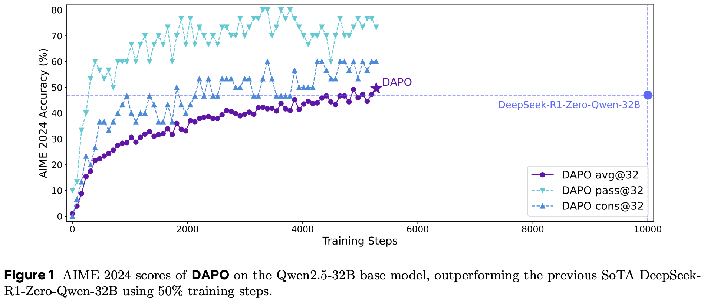
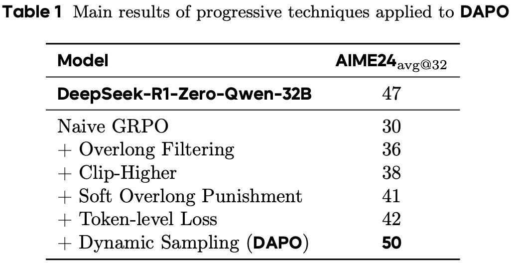

# Awesome-RRT 

Collection of Reasoning RL Tricks (RRT).

> The **Awesome-RRT Collection** aims to provide resources and empirical insights on reinforcement learning (RL) training for large language model (LLM) reasoning. While RL has significantly advanced LLM reasoning, its training remains highly unstable and is influenced by various factors, such as hyperparameters and data.

In this repository, we systematically analyze and compare recent efforts to reproduce DeepSeek-R1, focusing on training details to provide insights that facilitate the efficient implementation of RL training. Additionally, we track the latest advancements in this field and curate relevant resources, including datasets, frameworks, and implementations.

---

## :mag:Table of Contents

- [Awesome-RRT ](#awesome-rrt-)
  - [:mag:Table of Contents](#magtable-of-contents)
  - [🔥Updates](#updates)
  - [Projects](#projects)
    - [Overview](#overview)
    - [LLM](#llm)
      - [DAPO](#dapo)
      - [TinyZero](#tinyzero)
    - [LMM](#lmm)
      - [R1-VL](#r1-vl)
  - [Findings](#findings)
  - [Resources](#resources)
      - [Backbones](#backbones)
      - [Datasets](#datasets)
      - [Frameworks](#frameworks)
      - [Benchmarks](#benchmarks)
  - [Acknowledgment](#acknowledgment)

---

## 🔥Updates

- 🔥 **[2025.03.20]** Add [DAPO](https://dapo-sia.github.io) - an Open-Source LLM Reinforcement Learning System at Scale.

---

## Projects

### Overview

|                         | Links                                                        | Date                                               | Base Model                                                   | Tasks                     | Training Resources                                  | Details                      |
| ----------------------- | ------------------------------------------------------------ | ------------------------------------------------------------ | ------------------------------------------------------------ | --------------------------------------------------- | --------------------------------------------------- | --------------------------------------------------- |
| DAPO          | [[Page]](https://dapo-sia.github.io) [[Code]](https://github.com/BytedTsinghua-SIA/DAPO) [[Paper]](https://arxiv.org/pdf/2503.14476) | 2025/03/18                                        | Qwen2.5-32B                                       | Mathematical  Reasoning | -                                                   | [[DAPO]](#dapo)                                    |
| TinyZero                | [[Code]](https://github.com/Jiayi-Pan/TinyZero) [[Experiment Log]](https://wandb.ai/jiayipan/TinyZero) | 2025-01-24                               | Qwen-2.5-3B Instruct                                        | Countdown               | 4 A800s                                             | [[TinyZero]](#tinyzero) |

### LLM

#### <mark>DAPO</mark>

- Paper: https://arxiv.org/pdf/2503.14476v1
- Code: https://github.com/BytedTsinghua-SIA/DAPO

| Name          | Value                                                        |
| ------------- | ------------------------------------------------------------ |
| Backbone      | :hugs:[Qwen2.5-32B](https://huggingface.co/Qwen/Qwen2.5-32B) |
| Hyperparams   | train_batch_size: rollout_batch_size: n_samples_per_prompt: episode: epoch: learning_rate: rl_advantage: gpus (hours): |
| Training Data | Link: [[Data]](https://huggingface.co/datasets/BytedTsinghua-SIA/DAPO-Math-17k) Size: 17k Source: AoPS website |
| RL-Curve      |  |
| Results       |  |
| Tricks        |                                                              |

#### <mark>TinyZero</mark>

### LMM

#### <mark>R1-VL</mark>

---

## Findings

Based on the above reproduction projects, we can derive several findings for stable and efficient training:

- Hyperparams
- Phases
- Datasets
- Backbones

---

## Resources

#### Backbones

DeepSeek Series

Qwen Series

#### Datasets

#### Frameworks

#### Benchmarks

---

## Acknowledgment

We thank the following projects for providing valuable resources:

Blog:

- https://iclr-blog-track.github.io/2022/03/25/ppo-implementation-details/

Awesome List:

- https://github.com/huggingface/open-r1
- https://github.com/haoyangliu123/awesome-deepseek-r1
- https://github.com/JarvisUSTC/Awesome-DeepSeek-R1-Reproduction
- https://github.com/modelscope/awesome-deep-reasoning
- https://github.com/bruno686/Awesome-RL-based-LLM-Reasoning
- https://github.com/pemami4911/awesome-hyperparams

